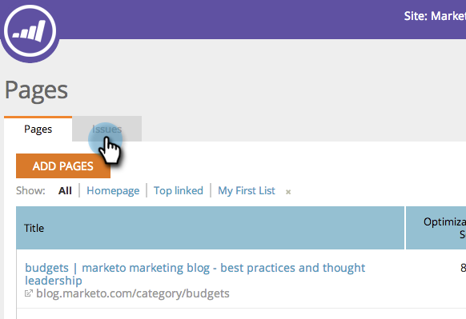

# SEO - ページに関する問題へのメモの追加 {#seo-add-notes-to-page-issues}

個人用のリマインダーやチームメッセージとして、ページの問題にメモを追加できることをご存じでしょうか。

## 「ページの問題」セクションへのメモの追加 {#adding-notes-in-page-issues-section}

1. 「ページ」セクションに移動します。

   

1. ページタブで、「**問題**」をクリックします。

   

1. メモを追加する問題の上にマウスポインターを置きます。「**ノート注釈を追加**」をクリックします。

   

1. 黄色のテキストボックスにメモを入力します。テキストボックスの外側をクリックすると、メモが保存されます。

>[!TIP]
>
>ノートを削除するには、左上隅の小さな **x** をクリックします。

## ページ詳細ドリルダウンでのメモの追加 {#add-notes-in-page-detail-drill-down}

1. 「ページ」セクションに移動します。

   

1. 詳細を表示するページをクリックします。

   

1. メモを追加するページの問題の上にマウスポインターを置いて、「**メモを追加**」をクリックします。

   

1. メモを入力します。「**保存**」をクリックします。

   

   これで、メモが追加されました。

   
