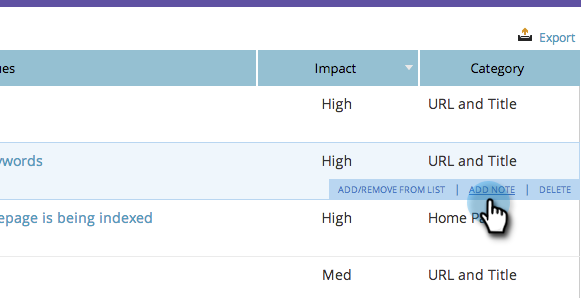

# SEO — ページの追加問題に関する注意{#seo-add-notes-to-page-issues}

個人のリマインダーやチームのメッセージとして、ページの雑誌号にメモを追加できることを知っていますか。

## ページの問題セクション{#adding-notes-in-page-issues-section}にメモを追加する

1. 「ページ」セクションに移動します。

   

1. 「ページ」タブで、「**問題**」をクリックします。

   

1. メモを追加する雑誌号の上にカーソルを置きます。 「**ノート注釈追加**」をクリックします。

   

1. 黄色のテキストボックスにメモを入力します。 テキストボックスの外側をクリックすると、メモが保存されます。

>[!TIP]
>
>メモを削除するには、左上隅の小さな&#x200B;**x**&#x200B;をクリックします。

## ページ追加詳細のドリルダウンのメモ{#add-notes-in-page-detail-drill-down}

1. 「ページ」セクションに移動します。

   

1. 詳細を表示するページをクリックします。

   

1. メモを追加するページの問題の上にカーソルを置き、「**追加メモ**」をクリックします。

   

1. メモを入力します。 「**保存**」をクリックします。

   

   メモが追加されました。

   
