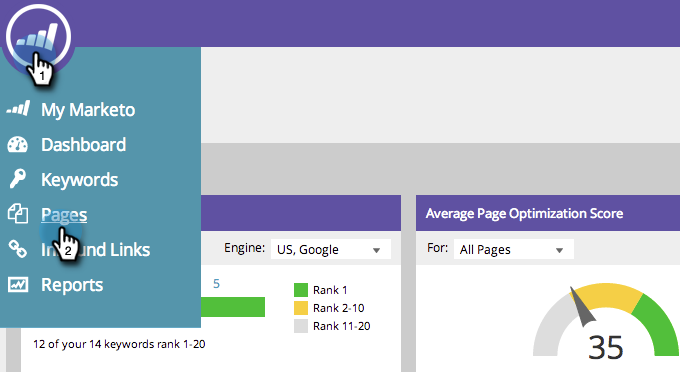

# SEO -追加ページ {#seo-add-pages}

ページがある！ Marketo Seoは、サイトを自動的にクロールし、追跡します。 いくつか見逃した場合は、次のようにSEOアプリで入手します。

1. 「 **ページ** 」セクションに移動します。

   

1. 「 **追加ページ**」をクリックします。

   

1. 追加するURLを入力します。 をクリックし **追加ます**。

   

   >[!TIP]
   >
   >ページを新しいリストーに [追加できるか、既存のーに追加できるか](../../../../product-docs/additional-apps/seo/understanding-seo/seo-managing-lists.md)。 見ろ！

   ページデータが読み込まれるまでしばらく時間がかかる場合があります。 緑の警告メッセージが表示されるのを待ち、ページを更新して表示を更新します。
   

   簡単な小作農のレモン絞り！ 検索でのこのページのパフォーマンスを追跡できるようになりました。

