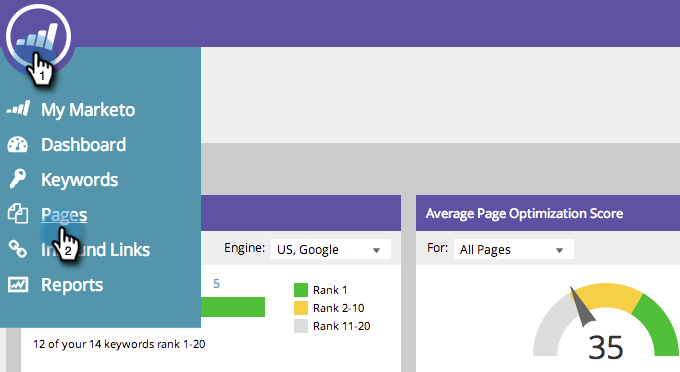

# SEO - ページの追加 {#seo-add-pages}

Marketo SEO は、サイトを自動的にクロールしてトラッキングします。いくつか見逃した場合は、このように SEO アプリに入れてください。

>[!IMPORTANT]
>
>2026 年 3 月 31 日（PT）に、Marketo Engageは検索エンジン最適化機能を廃止します。 3 月 30 日以前に関連データを書き出してください。 [詳細情報](https://nation.marketo.com/t5/product-blogs/marketo-engage-seo-feature-deprecation/ba-p/359060){target="_blank"}。
>
>* [ 書き出しの問題 ](https://experienceleague.adobe.com/en/docs/marketo/using/product-docs/additional-apps/seo/pages/seo-export-issues-to-csv){target="_blank"}
>* [ キーワード結果のエクスポート ](https://experienceleague.adobe.com/en/docs/marketo/using/product-docs/additional-apps/seo/keywords/seo-exporting-keyword-results){target="_blank"}
>* [ キーワードのトレンドを書き出し ](https://experienceleague.adobe.com/en/docs/marketo/using/product-docs/additional-apps/seo/reports/seo-use-the-keyword-trends-report#exporting-data){target="_blank"}
>* [ 競合企業キーワードの傾向のエクスポート ](https://experienceleague.adobe.com/en/docs/marketo/using/product-docs/additional-apps/seo/reports/seo-use-the-competitor-kw-trends-report#exporting-data){target="_blank"}

1. 「**[!UICONTROL ページ]**」セクションに移動します。

   

1. 「**[!UICONTROL ページを追加]**」をクリックします。

   

1. 追加する URL を入力します。「**[!UICONTROL 追加]**」をクリックします。

   

   >[!TIP]
   >
   >[新しいリストまたは既存のリストにページを追加](/help/marketo/product-docs/additional-apps/seo/understanding-seo/seo-managing-lists.md)できることをご存知ですか？ご確認ください。

   ページデータが読み込まれるまでしばらく時間がかかる場合があります。緑のアラートメッセージが表示されてから、ページを更新して画面を更新します。

   

   これで、このページの検索においてのパフォーマンスをトラックできるようになりました。
