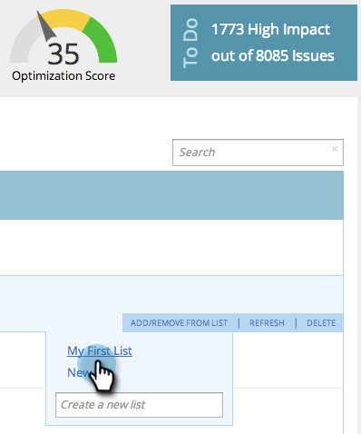

# SEO - リストに対するページの追加／削除 {#seo-add-remove-page-from-list}

リストを作成してページを簡単に管理します。 リストを使用して、ページを整理したり、ダッシュボードのデータをフィルターしたりできます。

>[!IMPORTANT]
>
>2026 年 3 月 31 日（PT）に、Marketo Engageは検索エンジン最適化機能を廃止します。 3 月 30 日以前に関連データを書き出してください。 [詳細情報](https://nation.marketo.com/t5/product-blogs/marketo-engage-seo-feature-deprecation/ba-p/359060){target="_blank"}。
>
>* [ 書き出しの問題 ](https://experienceleague.adobe.com/en/docs/marketo/using/product-docs/additional-apps/seo/pages/seo-export-issues-to-csv){target="_blank"}
>* [ キーワード結果のエクスポート ](https://experienceleague.adobe.com/en/docs/marketo/using/product-docs/additional-apps/seo/keywords/seo-exporting-keyword-results){target="_blank"}
>* [ キーワードのトレンドを書き出し ](https://experienceleague.adobe.com/en/docs/marketo/using/product-docs/additional-apps/seo/reports/seo-use-the-keyword-trends-report#exporting-data){target="_blank"}
>* [ 競合企業キーワードの傾向のエクスポート ](https://experienceleague.adobe.com/en/docs/marketo/using/product-docs/additional-apps/seo/reports/seo-use-the-competitor-kw-trends-report#exporting-data){target="_blank"}

## リストにページを追加する {#add-page-to-a-list}

1. 「**[!UICONTROL ページ]**」セクションに移動します。

   

1. リストに追加するページにポインタを合わせます。「**[!UICONTROL リストに追加／リストから削除]**」をクリックします。

   

1. ページを追加するリストをクリックします。

   

   >[!TIP]
   >
   >また、ページを入れる新しいリストを作成することもできます。「[!UICONTROL 新しいリストを作成]」に名前を入力します。

1. 追加したリストをクリックしてページを追加します。

   

これで完了です。ページがリストに追加されました。

## リストからページを削除する {#remove-page-from-a-list}

1. 「**[!UICONTROL ページ]**」セクションに移動します。

   

1. 「**[!UICONTROL ページ]**」タブで、クリーンアップするリストをクリックします。

   

1. 削除するページにポインタを合わせます。「**[!UICONTROL リストに追加／リストから削除]**」をクリックします。

   

1. ページを削除するリストをクリックします。

   >[!NOTE]
   >
   >キーワードが現在属しているすべてのリストに、チェックマークが付きます。リストから削除すると、チェックが消えます。

   

完了です。ページがリストから削除されました。
