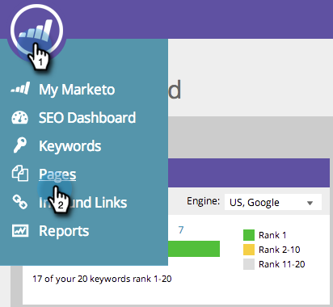

# SEO - リストに対するページ問題の追加／削除 {#seo-add-remove-page-issue-from-a-list}

ページの問題をリストに整理できます。また、リストからページの問題を削除することもできます。

>[!IMPORTANT]
>
>2026 年 3 月 31 日（PT）に、Marketo Engageは検索エンジン最適化機能を廃止します。 3 月 30 日以前に関連データを書き出してください。 [詳細情報](https://nation.marketo.com/t5/product-blogs/marketo-engage-seo-feature-deprecation/ba-p/359060){target="_blank"}。
>
>* [&#x200B; 書き出しの問題 &#x200B;](https://experienceleague.adobe.com/ja/docs/marketo/using/product-docs/additional-apps/seo/pages/seo-export-issues-to-csv){target="_blank"}
>* [&#x200B; キーワード結果のエクスポート &#x200B;](https://experienceleague.adobe.com/ja/docs/marketo/using/product-docs/additional-apps/seo/keywords/seo-exporting-keyword-results){target="_blank"}
>* [&#x200B; キーワードのトレンドを書き出し &#x200B;](https://experienceleague.adobe.com/ja/docs/marketo/using/product-docs/additional-apps/seo/reports/seo-use-the-keyword-trends-report#exporting-data){target="_blank"}
>* [&#x200B; 競合企業キーワードの傾向のエクスポート &#x200B;](https://experienceleague.adobe.com/ja/docs/marketo/using/product-docs/additional-apps/seo/reports/seo-use-the-competitor-kw-trends-report#exporting-data){target="_blank"}

## ページの問題のリストへの追加 {#add-page-issues-to-a-list}

1. 「**[!UICONTROL ページ]**」セクションに移動します。

   

1. 「**[!UICONTROL ページ]**」タブで、「**[!UICONTROL 問題]**」をクリックします。

   

1. 追加するページの問題にポインタを合わせます。「**[!UICONTROL リストに追加／リストから削除]**」をクリックします。

   

   ページの問題を追加するリストをクリックします。

   

   >[!TIP]
   >
   >また、キーワードを入れる新しいリストを作成することもできます。「**[!UICONTROL 新しいリストを作成]**」に名前を入力します。

## ページの問題のリストからの削除 {#remove-page-issue-from-a-list}

1. 「**[!UICONTROL ページ]**」セクションに移動します。

   

1. 「ページ」タブで、「**[!UICONTROL 問題]**」をクリックします。

   

1. 整理するリストをクリックします。

   

1. 削除するページ問題にポインタを合わせます。「**[!UICONTROL リストに追加／リストから削除]**」をクリックします。

   

1. 整理するリストがチェックされます。リスト名をクリックして、このリストからページの問題を削除します。

   

これで完了です。ページを更新すると、リストに表示されなくなります。
