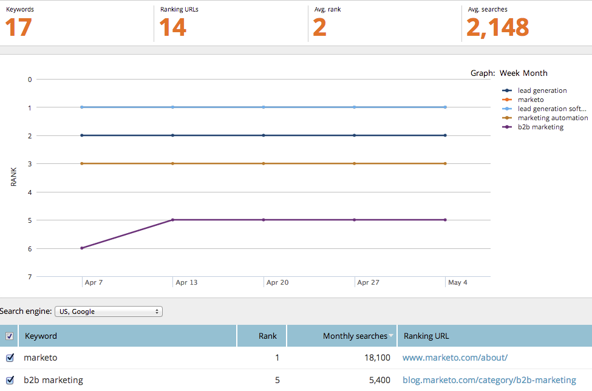

# SEO — キーワードトレンドレポートの使用{#seo-use-the-keyword-trends-report}

このレポートでは、時間の経過に伴うキーワードのランク付けを確認できます。

## レポートの読み込み{#load-report}

1. **レポート**&#x200B;に移動します。

   

1. **キーワードランクの傾向**&#x200B;をクリックします。

   

   次に示します。

   

   説明されているレポート項目：

   | 項目 | 説明 |
   |---|---|
   | キーワード | 追跡しているキーワードの数。 |
   | ランキングURL | 設定した範囲での、サイトのランクに表示されるURLの数。 |
   | 平均 ランク | 設定した範囲内のキーワードの平均ランク。 |
   | 平均 検索 | 設定した範囲（過去30日間、Google US検索）内に発生したキーワードの平均検索回数 |

## データのフィルタ{#filtering-data}

1. ドロップダウンをクリックし、目的の期間を選択します。

   

1. 「ランク」ドロップダウンをクリックして、キーワードを表示するランク範囲を選択します。

   

## データのエクスポート{#exporting-data}

>[!TIP]
>
>このレポートはデスクトップにエクスポートできます。

1. 「CSVまたはExport PDFを書き出し」をクリックします。

   

   素晴らしい仕事！ また、キーワードのランキングで、競合他社と比較した結果を確認することもできます。

   >[!NOTE]
   >
   >**関連記事**
   >
   >    
   >    
   >    * [競合KWランクトレンドレポートの使用](seo-use-the-competitor-kw-trends-report.md)

