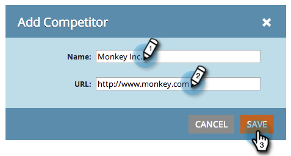

# SEO - 競合相手の追加 {#seo-add-competitors}

競合他社を追加すると、監視対象として選択したものと同じキーワードおよびインバウンドリンクに対する競合他社のパフォーマンスをトラッキングできます。

>[!IMPORTANT]
>
>2026 年 3 月 31 日（PT）に、Marketo Engageは検索エンジン最適化機能を廃止します。 3 月 30 日以前に関連データを書き出してください。 [詳細情報](https://nation.marketo.com/t5/product-blogs/marketo-engage-seo-feature-deprecation/ba-p/359060){target="_blank"}。
>
>* [ 書き出しの問題 ](https://experienceleague.adobe.com/en/docs/marketo/using/product-docs/additional-apps/seo/pages/seo-export-issues-to-csv){target="_blank"}
>* [ キーワード結果のエクスポート ](https://experienceleague.adobe.com/en/docs/marketo/using/product-docs/additional-apps/seo/keywords/seo-exporting-keyword-results){target="_blank"}
>* [ キーワードのトレンドを書き出し ](https://experienceleague.adobe.com/en/docs/marketo/using/product-docs/additional-apps/seo/reports/seo-use-the-keyword-trends-report#exporting-data){target="_blank"}
>* [ 競合企業キーワードの傾向のエクスポート ](https://experienceleague.adobe.com/en/docs/marketo/using/product-docs/additional-apps/seo/reports/seo-use-the-competitor-kw-trends-report#exporting-data){target="_blank"}

1. 「**[!UICONTROL 管理者]**」領域に移動します。

   

1. 「**[!UICONTROL 競合他社]**」タブをクリックします。

   

1. 「**[!UICONTROL 競合他社を追加]**」をクリックします。

   

1. 競合他社の「**[!UICONTROL 名前]**」および「**[!UICONTROL URL]**」を選択します。

   

   リストに競合相手が表示されるようになりました。

   

   >[!MORELIKETHIS]
   >
   >* [キーワードの追加](/help/marketo/product-docs/additional-apps/seo/keywords/seo-add-keywords.md){target="_blank"}
   >* [キーワードについて（競合他社の表示）](/help/marketo/product-docs/additional-apps/seo/keywords/seo-understanding-keywords.md){target="_blank"}
