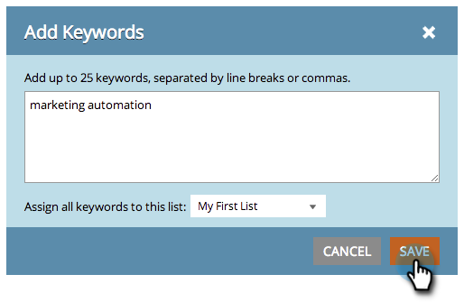

# SEO -リストの管理 {#seo-managing-lists}

キーワード、ページ、ページの問題、またはインバウンドリンクを追加する際に、リストに追加できます。 リストを使用すると、レポートを整理し、そのリストのデータのみを表示するようにレポートをフィルタできます。 作り方を次に示します。

1. 「 **追加KEYWORDS**」をクリックします。

   >[!NOTE]
   >
   >これは、ページ、ページに関する問題、インバウンドリンクを追加する場合と同じように機能します。

   

1. キーワードを入力します。 ドロップダウンからリストを選択し、追加先を選択します。

   

   >[!TIP]
   >
   >ドロップダウンリストで新しいリストを作成できます。 タイトルを入力し、Returnキーを押します。  >

1. 「 **保存**」をクリックします。

   

   組織立て！

