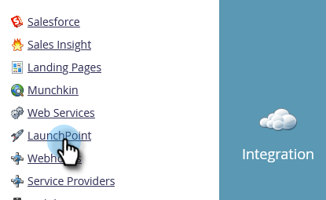

# マネージャーアカウントで [!DNL Google AdWords] を [!DNL Launchpoint] サービスとして追加 {#add-google-adwords-as-a-launchpoint-service-with-a-manager-account}

[!DNL Google AdWords] アカウントを Marketo にリンクして、オフラインのコンバージョンデータを Marketo から [!DNL Google AdWords] に自動的にアップロードします。[!DNL AdWords] に[カスタム列を追加](https://support.google.com/adwords/answer/3073556){target="_blank"}した後、どのクリックが条件を満たすリードや商談、新規顧客（またはトラッキングしたいあらゆる売上高ステージ）につながったのかを [!DNL AdWords] UI から簡単に確認できるようになります。この情報は、Marketo UI には表示されません。

複数の [!DNL Google Adwords] アカウントがある場合、[[!DNL Google AdWords Manager Account]](https://www.google.com/adwords/manager-accounts/){target="_blank"}（以前の [!DNL My Client Center]）を使用して、それらを Marketo と統合できます。

詳しくは、[Google のオフラインコンバージョンのインポート機能](https://support.google.com/adwords/answer/2998031?hl=ja){target="_blank"}を参照してください。

>[!AVAILABILITY]
>
>すべての Marketo Engage ユーザがこの機能を購入しているわけではありません。詳しくは、アドビのアカウントチーム（担当のアカウントマネージャー）にお問い合わせください。

>[!NOTE]
>
>**管理者権限が必要**

>[!NOTE]
>
>また、[スタンドアロンの  [!DNL Google AdWords]  アカウントを  [!DNL Launchpoint]  サービスとして](/help/marketo/product-docs/administration/additional-integrations/add-google-adwords-as-a-launchpoint-service.md){target="_blank"}統合できます。

1. 「**[!UICONTROL 管理者]**」領域に移動します。

   

1. 「**[!UICONTROL LaunchPoint]**」を選択します。

   

1. **[!UICONTROL 新規]**&#x200B;ドロップダウンをクリックして、**[!UICONTROL 新規サービス]**&#x200B;を選択します。

   

1. **[!UICONTROL 表示名]**&#x200B;を入力し、「**[!UICONTROL Google AdWords]**」を選択します。

   

1. 「**[!UICONTROL Marketo を承認]**」を選択します。

   >[!NOTE]
   >
   >個人の [!DNL Gmail] アカウントからログアウトし、ポップアップを有効にします。

   

1. **[!DNL Google AdWords]** に関連付けられたアカウントを選択します。

   

1. 「**[!UICONTROL 確定]**」をクリックします。

   

1. ステータスは「**[!UICONTROL 成功]**」と表示されます。「**[!UICONTROL 次へ]**」を選択します。

   

1. Marketo から [!DNL Google AdWords] にオフラインコンバージョンをアップロードする送信頻度として、「**[!UICONTROL 毎週]**」または「**[!UICONTROL 毎日]**」を選択します。

   

1. 属性コンバージョンで、「**[!UICONTROL 最初のクリック]**」または「**[!UICONTROL 最後のクリック]**」を選択します。

   

   | タイプ | 定義 |
   |---|---|
   | [!UICONTROL 最初のクリック] | オフラインコンバージョンは、過去 90 日間で人物がクリックした最初の [!DNL AdWords] 広告に起因します |
   | [!UICONTROL 最後のクリック] | オフラインコンバージョンは、人物がクリックした最後の [!DNL AdWords] 広告に起因します |

   >[!NOTE]
   >
   >この機能を使用するには、[自動タギング](https://support.google.com/adwords/answer/1752125?hl=ja){target="_blank"}を選択する必要があります。[!DNL AdWords] 内で有効化する必要があります。

1. 「**[!UICONTROL 次へ]**」をクリックします。

   

1. 更新しないアカウントの選択を解除します。「**[!UICONTROL 作成]**」をクリックします。

   

   次に、売上高モデルで [!DNL AdWords] のオフラインコンバージョンをマッピングする方法について、以下の関連記事を参照してください。

   >[!MORELIKETHIS]
   >
   >[売上高モデルでの  [!DNL Google AdWords]  コンバージョンの設定](/help/marketo/product-docs/reporting/revenue-cycle-analytics/revenue-cycle-models/set-google-adwords-conversions-in-the-revenue-model-with-a-manager-account.md){target="_blank"}
