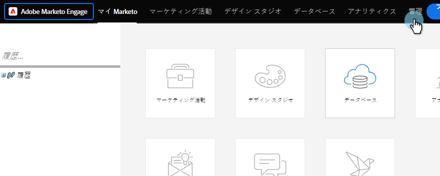
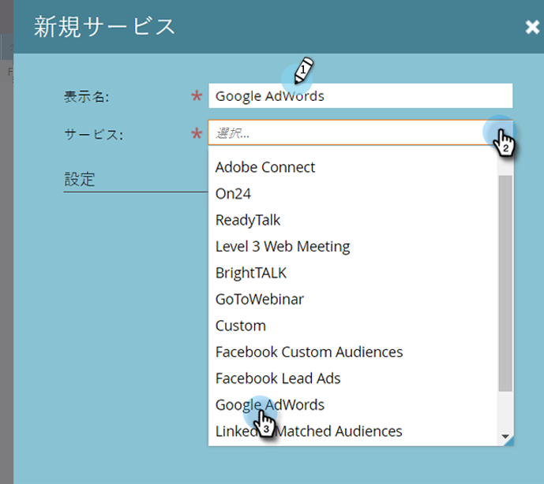

# LaunchPoint追加サービスとしてのGoogle AdWords {#add-google-adwords-as-a-launchpoint-service}

Google AdWordsアカウントをMarketorにリンクして、オフラインコンバージョンデータをMarketoからGoogle AdWordsに自動的にアップロードします。 次に、AdWords UIから、AdWordsにカスタム列を [追加した後、条件を満たしたリード、オポチュニティ、新規顧客(または追跡したい任意の売上ステージ](https://support.google.com/adwords/answer/3073556) )に導いたクリックを簡単に確認できます。 この情報は、Marketo UIには表示されません。

[Googleのオフラインコンバージョンインポート機能についての詳細](https://support.google.com/adwords/answer/2998031?hl=en)。

>[!NOTE]
>
>**必要な管理者権限**

>[!NOTE]
>
>また、 [Google AdWordsをLaunchpointサービスとしてマネージャーアカウントと統合することもできます](add-google-adwords-as-a-launchpoint-service-with-a-manager-account.md)。

1. 「 **管理者** 」セクションに移動します。

   

1. 「 **LaunchPoint**」を選択します。

   

1. 「 **New** and **New Service**」を選択します。

   

1. 表示名を入力し、「 **Google AdWords**」を選択します。

   

1. 「マーケティング **を許可**」を選択します。

   >[!NOTE]
   >
   >個人のGmailアカウントからログアウトし、ポップアップを有効にしてください。

   

1. Google AdWordsに関連付けられているアカウントを選択します。

   

1. 「 **承認**」を選択します。

   

1. ステータスは「 **成功**」と表示されます。 「 **次へ**」を選択します。

   

1. オフラインコンバージョンをMarkettoからGoogle AdWordsに**Weekly **または **Daily**&#x200B;にアップロードします。

   

1. 「 **最初のクリック** 」または「 **最後のクリック**」に変換された属性。

   | タイプ | 定義 |
   |---|---|
   | 最初のクリック | オフラインコンバージョンは、最初のAdWordsと、過去90日間にユーザーがクリックしたAdWordsに関連付けられます |
   | 最後のクリック | オフラインコンバージョンは、最後にクリックしたAdWords広告に関連付けられます |

   >[!NOTE]
   >
   >MarketorとAdWordsで一貫したアトリビューションモデルを使用すると、最も正確なデータが提供されます。

   

1. 「 **作成**」をクリックします。

   

   >[!NOTE]
   >
   >[この機能が動作するには](https://support.google.com/adwords/answer/1752125?hl=en) 、自動タグ付けを選択する必要があります。 非アクティブ化はAdWords内で行う必要があります。

   >[!NOTE]
   >
   >**関連記事**
   >
   >    
   >    
   >    * [売上高モデルでのGoogle AdWordsコンバージョンの設定](../../../product-docs/reporting/revenue-cycle-analytics/revenue-cycle-models/set-google-adwords-conversions-in-the-revenue-model.md)

素晴らしい！ 次の関連記事を参照して、売上高モデルでAdWordのオフラインコンバージョンをマッピングする方法を学習してください。