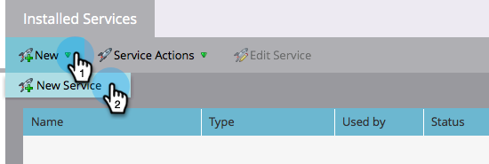

# Google AdWords を LaunchPoint サービスとして追加 {#add-google-adwords-as-a-launchpoint-service}

Google AdWords アカウントを Marketo にリンクすることで、オフラインのコンバージョンデータを Marketo から Google AdWords に自動的にアップロードできます。AdWords に[カスタム列を追加](https://support.google.com/adwords/answer/3073556)した後、AdWords の UI から、どのクリックがクオリファイドリードや商談、新規顧客（またはトラックしたいあらゆる売上高ステージ）につながったのかを簡単に確認できるようになります。{target="_blank"}この情報は、Marketo UI には表示されません。

詳細情報： [Googleのオフライン変換インポート機能](https://support.google.com/adwords/answer/2998031?hl=ja){target="_blank"}.

>[!AVAILABILITY]
>
>すべての顧客がこの機能を購入したわけではありません。詳しくは、Adobeアカウントチーム（担当のアカウントマネージャー）にお問い合わせください。

>[!NOTE]
>
>**管理者権限が必要**

>[!NOTE]
>
>また、[Google AdWords を Launchpoint のサービスとしてマネージャーアカウントと統合する](/help/marketo/product-docs/administration/additional-integrations/add-google-adwords-as-a-launchpoint-service-with-a-manager-account.md){target="_blank"}こともできます。

1. 「**管理者**」セクションに移動します。

   

1. 「**LaunchPoint**」を選択します。

   

1. 「**新規**」と「**新規サービス**」を選択します。

   

1. 表示名を入力し、「**Google AdWords**」を選択します。

   

1. 「**Marketo を承認**」を選択します。

   >[!NOTE]
   >
   >個人の Gmail アカウントからログアウトし、ポップアップを有効にします。

   

1. Google AdWords に関連付けられたアカウントを選択します。

   

1. 「**承認**」を選択します。

   

1. ステータスは「**成功**」と表示されます。「**次へ**」を選択します。

   

1. Marketo から Google AdWords にオフラインコンバージョンをアップロードする送信頻度として、「**毎週**」または「**毎日**」を選択します。

   

1. 属性コンバージョンで、「**最初のクリック**」または「**最後のクリック**」を選択します。

   

   | タイプ | 定義 |
   |---|---|
   | 最初のクリック | オフラインコンバージョンは、過去 90 日間にユーザーが最初にクリックした AdWords に関連付けられます |
   | 最後のクリック | オフラインコンバージョンは、最後にクリックした AdWords とユーザーがクリックした広告に関連付けられます |

   >[!NOTE]
   >
   >Marketo と AdWords で一貫した属性モデルを使用することで、最も正確なデータが得られます。

1. 「**作成**」をクリックします。

   

   >[!NOTE]
   >
   >この機能を使用するには、[自動タグ付け](https://support.google.com/adwords/answer/1752125?hl=ja){target="_blank"}を選択する必要があります。非アクティブ化は AdWords 内で行う必要があります。

これで完了です。次は、関連記事を参照して、売上高モデルで AdWords のオフラインコンバージョンをマッピングする方法を学びましょう。

>[!MORELIKETHIS]
>
>[売上高モデルでの Google AdWords コンバージョンの設定](/help/marketo/product-docs/reporting/revenue-cycle-analytics/revenue-cycle-models/set-google-adwords-conversions-in-the-revenue-model.md){target="_blank"}
