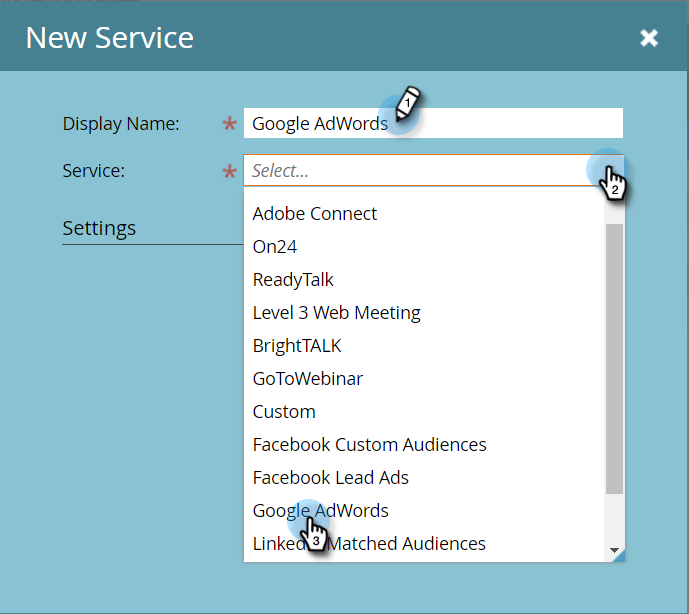

# 追加 [!DNL Google AdWords] as a [!DNL LaunchPoint] サービス {#add-google-adwords-as-a-launchpoint-service}

リンク [!DNL Google AdWords] アカウントをMarketoに自動的にアップロードし、Marketoからにオフラインのコンバージョンデータを [!DNL Google AdWords]. 次に、 [!DNL AdWords] UI を使用すると、どのクリックが選定されたリード、商談、新規顧客（または追跡したい収益ステージ）につながったかを簡単に確認できます [カスタム列を追加](https://support.google.com/adwords/answer/3073556){target="_blank"} in [!DNL AdWords]. この情報は、Marketo UI には表示されません。

詳しくは、[Google のオフラインコンバージョンのインポート機能](https://support.google.com/adwords/answer/2998031?hl=ja){target="_blank"}を参照してください。

>[!AVAILABILITY]
>
>必ずしもすべてのお客様がこの機能を購入済みとは限りません。詳しくは、アドビアカウントチーム（担当のアカウントマネージャー）にお問い合わせください。

>[!NOTE]
>
>**管理者権限が必要**

>[!NOTE]
>
>また、 [[!DNL Google AdWords] as a [!DNL Launchpoint] 管理者アカウントを持つサービス](/help/marketo/product-docs/administration/additional-integrations/add-google-adwords-as-a-launchpoint-service-with-a-manager-account.md){target="_blank"}.

1. 「**[!UICONTROL 管理者]**」領域に移動します。

   

1. 「**[!UICONTROL LaunchPoint]**」を選択します。

   

1. 「**[!UICONTROL 新規]**」と「**[!UICONTROL 新規サービス]**」を選択します。

   

1. を入力します。 [!UICONTROL 表示名] を選択し、 **[!UICONTROL Google AdWords]**.

   

1. 「**[!UICONTROL Marketo を承認]**」を選択します。

   >[!NOTE]
   >
   >個人からログアウトするようにしてください [!DNL Gmail] アカウントを作成し、ポップアップを有効にします。

   

1. 次に関連するアカウントを選択 [!DNL Google AdWords].

   

1. 「**[!UICONTROL 承認]**」を選択します。

   

1. ステータスは「**[!UICONTROL 成功]**」と表示されます。「**[!UICONTROL 次へ]**」を選択します。

   

1. Marketoからへのオフライン変換のアップロード [!DNL Google AdWords] **[!UICONTROL 毎週]** または **[!UICONTROL 毎日]**.

   

1. 属性コンバージョンで、「**[!UICONTROL 最初のクリック]**」または「**[!UICONTROL 最後のクリック]**」を選択します。

   

   | タイプ | 定義 |
   |---|---|
   | [!UICONTROL 最初のクリック] | オフラインコンバージョンは最初の [!DNL AdWords] 過去 90 日間にクリックした人 |
   | [!UICONTROL 最後のクリック] | オフラインコンバージョンは、最後の [!DNL AdWords] 人がクリックした広告 |

   >[!NOTE]
   >
   >Marketoおよび [!DNL AdWords] は、最も正確なデータを提供します。

1. 「**[!UICONTROL 作成]**」をクリックします。

   

   >[!NOTE]
   >
   >この機能を使用するには、[自動タグ付け](https://support.google.com/adwords/answer/1752125?hl=ja){target="_blank"}を選択する必要があります。無効化は内部で行う必要があります [!DNL AdWords].

完了です。マッピング方法については、以下の関連記事を参照してください。 [!DNL AdWords] オフラインコンバージョンを売上高モデルで使用できます。

>[!MORELIKETHIS]
>
>[設定 [!DNL Google AdWords] 売上高モデルのコンバージョン](/help/marketo/product-docs/reporting/revenue-cycle-analytics/revenue-cycle-models/set-google-adwords-conversions-in-the-revenue-model.md){target="_blank"}
