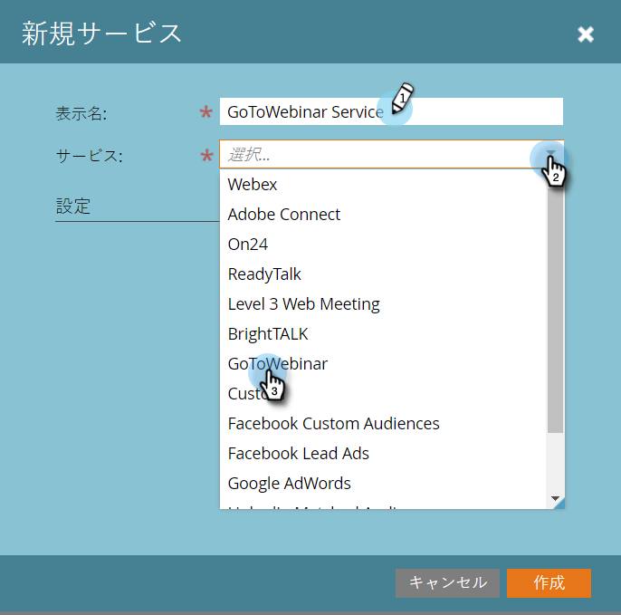

# GoToWebinar を LaunchPoint サービスとして追加 {#add-gotowebinar-as-a-launchpoint-service}

Marketo は、GoToWebinar の登録と出席を管理します。

>[!NOTE]
>
>**管理者権限が必要**

>[!NOTE]
>
>この手順では、GoToWebinar の既存の購読と管理権限が必要です。GoToWebinar のログインに使用するメールとパスワードをお手元にご用意ください。

>[!NOTE]
>
>GoToMeeting、GoToWebcast、GoToTraining は現在サポートされていません。

1. 「**管理**」に移動し、**LaunchPoint** を選択します。

   

1. 「**新規**」と「**新規サービス**」を選択します。

   

1. **表示名**&#x200B;を入力します。「**サービス**」で、「**GoToWebinar**」を選択します。

   

1. 次に、「**GoToWebinar** にログイン」をクリックします。

   

   >[!NOTE]
   >
   >Marketo フォームの会社名と役職を GoToWebinar に同期する場合は、「**追加フィールドを有効にする**」ボックスを選択します。

1. GoToWebinar のログインポップアップウィンドウで、**GoToWebinar** の電子メールとパスワードを入力し、「**ログイン**」をクリックします。

   

1. ウィンドウが閉じたら、「**作成**」をクリックします。

   

1. これで完了です。**GoToWebinar** アカウントが Marketo と同期されました。

   

>[!CAUTION]
>
>GoToWebinar でパスワードを更新する場合は、Marketo でもパスワードを更新する必要があります。

>[!MORELIKETHIS]
>
>[GotoWebinar でイベントを作成する方法](/help/marketo/product-docs/demand-generation/events/create-an-event/create-an-event-with-gotowebinar.md)を参照してください。
