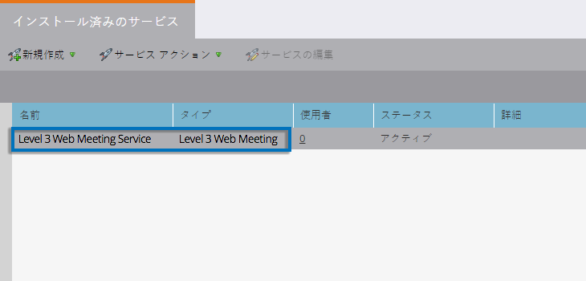

# Level 3 Web Meeting を LaunchPoint サービスとして追加 {#add-level-web-meeting-as-a-launchpoint-service}

Marketo は、Level 3 Web Meeting の登録と出席を管理します。

>[!NOTE]
>
>**管理者権限が必要**

>[!NOTE]
>
>この手順では、Level 3 Web Meeting と管理権限の既存のサブスクリプションが必要です。アクセス番号、アクセスコード、パスコードをお手元にご用意ください。

1. 「**管理**」に移動し、**LaunchPoint** を選択します。

   

1. 「**新規**」を選択し、次に「**新規サービス**」を選択します。

   

1. **表示名**&#x200B;を入力します。「**サービス**」で、「**Level 3 Web Meeting**」を選択します。

   

1. 「**アクセス番号**」、「**アクセスコード**」、「**パスコード**」を入力し、「**作成**」をクリックします。

   

これで、Level 3 Web Meeting アカウントが Marketo と同期されました。

>[!MORELIKETHIS]
>
>[Level 3 Web Meeting でイベントを作成する](/help/marketo/product-docs/demand-generation/events/create-an-event/create-an-event-with-level-3-web-meeting.md)方法を参照してください。
