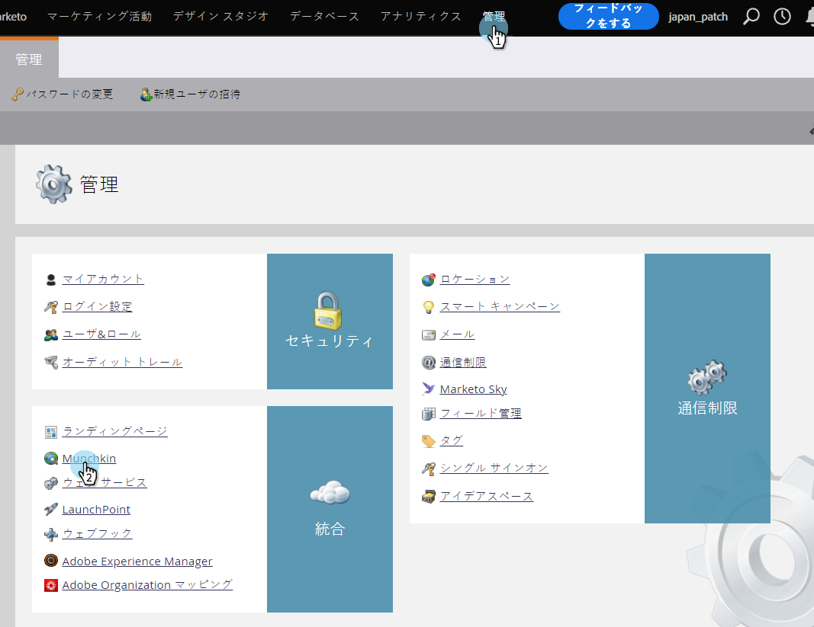
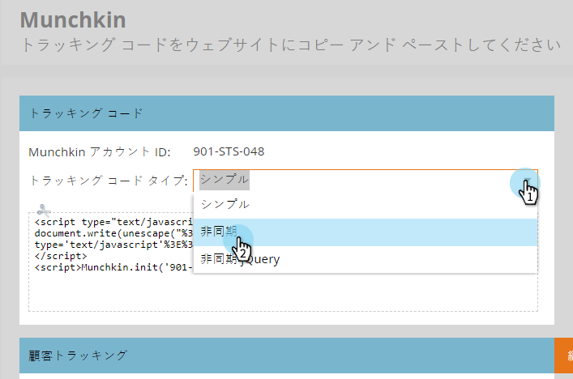
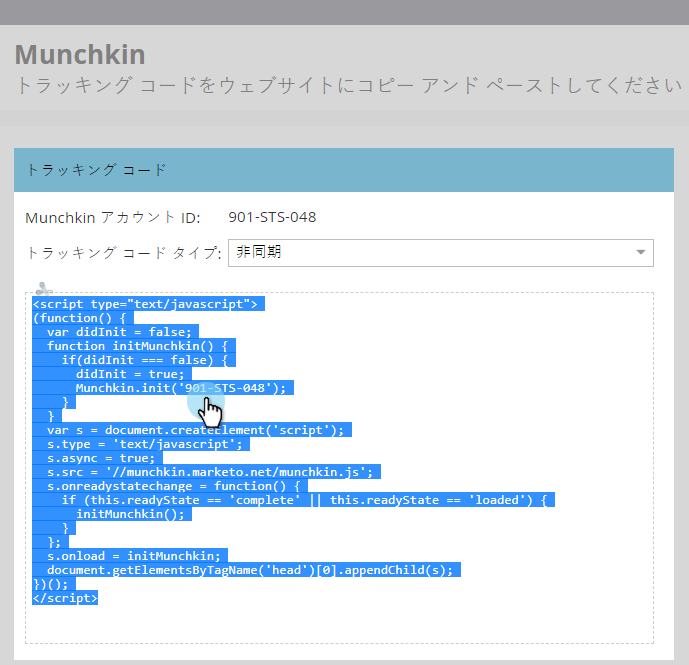
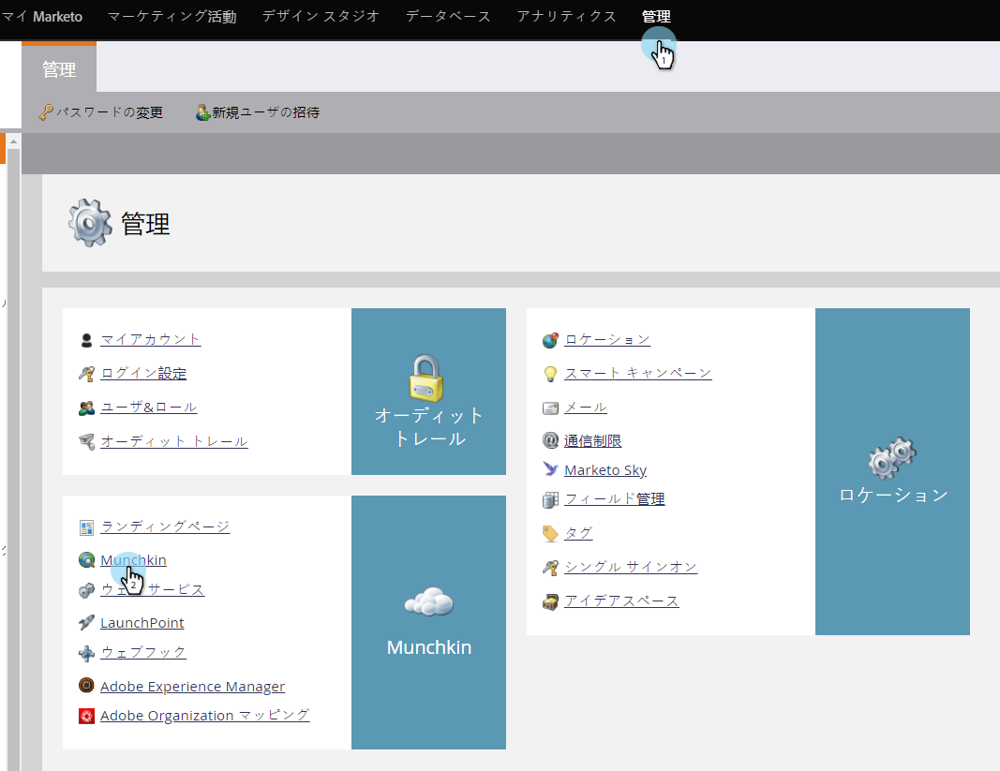
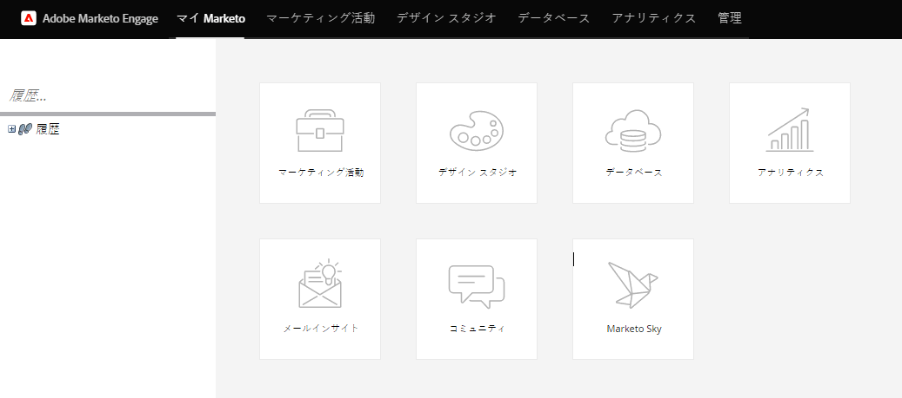
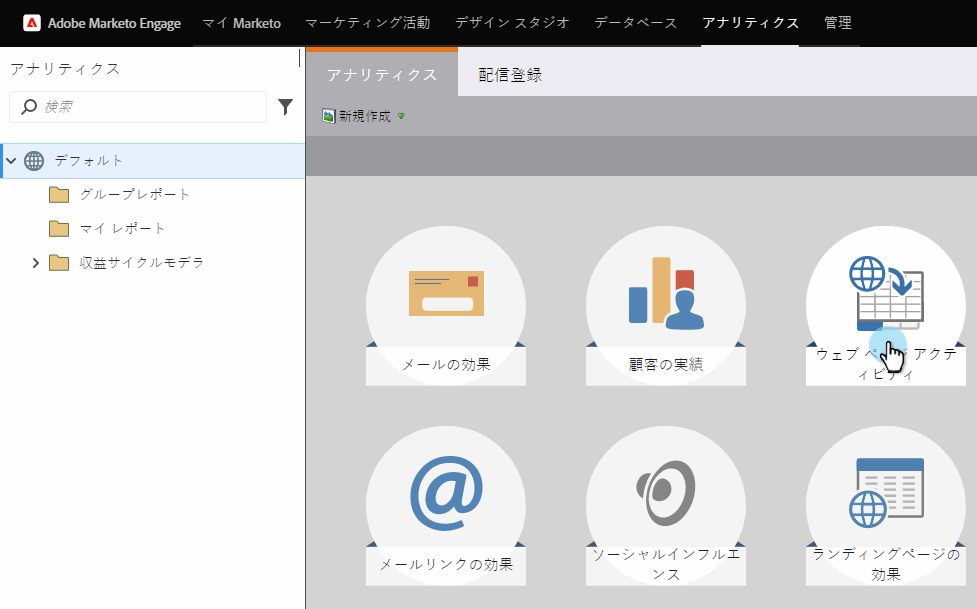
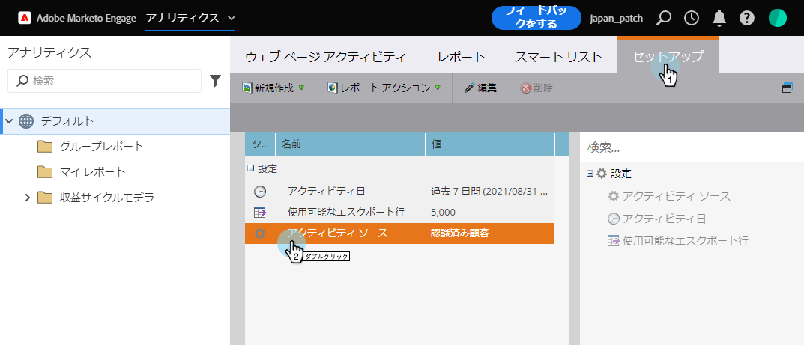
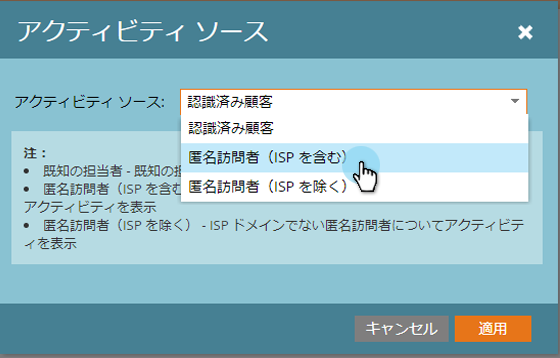

# Munchkin追加追跡コードをWebサイトに送信 {#add-munchkin-tracking-code-to-your-website}

Munchkinと呼ばれる、MarketoのカスタムJavaScriptトラッキングコードは、Webサイトを訪問するすべての個人を追跡するので、自動化されたマーケティングキャンペーンを使用して訪問に反応できます。 匿名訪問者でも、そのIPアドレスやその他の情報と共に追跡されます。 **このトラッキングコードがないと、Webサイト上の訪問や他のアクティビティを追跡できません。**

>[!NOTE]
>
>**前提条件**
>
>経験豊富なJavaScript開発者にアクセスできることを確認してください。 マーケティング担当者向けテクニカルサポートは、カスタムJavaScriptのトラブルシューティングを支援するように設定されていません。

## Webサイト追加へのトラッキングコード {#add-tracking-code-to-your-website}

>[!NOTE]
>
>また、Adobe Experience Cloudのお客様は、Adobe開始のMarketoの統合機能を使用して、MunchkinスクリプトをWebページに含めることもできます。 アプリを入手 [します](https://www.adobeexchange.com/experiencecloud.details.101054.html)。

1. 「 **管理者** 」に移動し、左側のツリーで「 **Munchkin** 」をクリックします。

   

   「追跡コードタイプ」で「非同期」を選択します。

   

   >[!NOTE]
   >
   >ほとんどの場合は、非同期コードを使用する必要があります。 [詳細情報](#types-of-munchkin-tracking-codes)

   をクリックし、JavaScriptトラッキングコードをコピーしてWebサイトに配置します。

   

   >[!CAUTION]
   >
   >このスクリーンショットに示すコードは使用しないでください。アカウントに表示される一意のコードを使用する必要があります。

   >[!TIP]
   >
   >追跡するWebページにトラッキングコードを設定します。 これは、小規模なサイトではすべてのページに当てはまり、多くの動的に生成されたウェブページやユーザーフォーラムなどを持つサイトでは主要ページに過ぎません。

   最良の結果を得るには、非同期Munchkinコードを使用し、ページの `<head>` 要素内に配置します。 単純なコードを使用する場合（非推奨）、これは `</body>` タグの直前にあります。
   

>[!TIP]
>
>トラフィック量の多いサイト（1か月に何十万回もの訪問など）の場合は、匿名ユーザーを追跡しないように推奨します。 [詳細情報](http://developers.marketo.com/documentation/websites/lead-tracking-munchkin-js/)

## 追加複数のワークスペースを使用する場合のトラッキングコード {#add-tracking-code-when-using-multiple-workspaces}

MarketorアカウントでWorkspacesを使用している場合は、ワークスペースに対応する個別のWebプレゼンスが存在する場合もあります。 この場合、マンチキン追跡JavaScriptを使用して、匿名ユーザーを正しいワークスペースとパーティションに割り当てることができます。

1. [管理者]に移動し、左側のツリーで[マンチキン]をクリックします。

1. 追跡するWebページに適したワークスペースを選択します。

>[!NOTE]
>
>特別なWorkspace Munchkinコードを使用しない場合、アカウントの設定時に作成された既定のパーティションにユーザーが割り当てられます。 最初は「デフォルト」という名前ですが、独自のMarketoアカウントで変更した可能性があります。

1. 「追跡コードタイプ」で「非同期」を選択します。

   

1. をクリックし、JavaScriptトラッキングコードをコピーしてWebサイトに配置します。

>[!CAUTION]
>
>このスクリーンショットに示すコードは使用しないでください。アカウントに表示される一意のコードを使用する必要があります。

1. 要素内のWebページにトラッキングコードを配置し `<head>` ます。 このページを訪問した新しいユーザーが、このパーティションに割り当てられます。

>[!CAUTION]
>
>ページ上の単一のパーティションとワークスペースに対して使用できるMunchkin追跡スクリプトは1つだけです。 Webサイト上の複数のパーティション/ワークスペースに対するトラッキングスクリプトを含めないでください。

>[!NOTE]
>
>Marketoで作成されたランディングページにはトラッキングコードが自動的に含まれるので、このコードを含める必要はありません。

## マンチキン追跡コードの種類 {#types-of-munchkin-tracking-codes}

マンチキントラッキングコードには3種類あり、選択できます。 Webページの読み込み時間は、それぞれ異なる影響を与えます。

1. **シンプル**:はコード行が最も少ないが、webページの読み込み時間に対しては最適化を行わない。 このコードは、Webページが読み込まれるたびにjQueryライブラリを読み込みます。
1. **非同期**:webページの読み込み時間を短縮します。
1. **非同期jQuery**:webページの読み込み時間を短縮し、システムパフォーマンスも向上します。 このコードは、既にjQueryがあると想定し、読み込みの確認は行いません。

## Munchkinコードが機能しているかどうかをテストする {#test-if-your-munchkin-code-is-working}

追加後にMunchkinコードが動作していることを確認するには：

1. Webページにアクセスします。
1. 「 **Analytics**」に移動します。

   

1. 「 **Webページアクティビティ**」をクリックします。

   

1. [ **セットアップ** ]タブをクリックし、[ **アクティビティソース**]を重複クリックして、[ **匿名訪問者（ISPを含む）]に変更します**。

   

   

1. 「 **レポート** 」タブをクリックします。 データが表示されない場合は、数分待ってから、下部の更新アイコンをクリックします。

