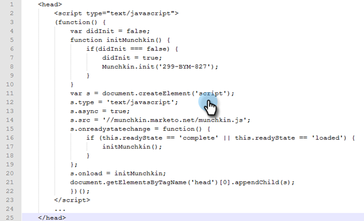

# Web サイトへの Munchkin トラッキングコードの追加 {#add-munchkin-tracking-code-to-your-website}

Marketo のカスタム JavaScript トラッキングコード、通称 Munchkin コードは、自動化されたマーケティングキャンペーンで応答できるように、自社の web サイトを訪問したすべてのユーザをトラックします。匿名の訪問者でも、IP アドレスなどの情報と共にトラックします。**このトラッキングコードがなければ、web サイトへの訪問やその他のアクティビティをトラックできません**。

>[!PREREQUISITES]
>
>経験豊富な JavaScript 開発者の協力を得るようにしてください。Marketo テクニカルサポートでは、カスタム JavaScript のトラブルシューティングについては対応できません。

## Web サイトへのトラッキングコードの追加 {#add-tracking-code-to-your-website}

>[!NOTE]
>
>Adobe Experience Cloud のお客様は、Adobe Launch で Marketo の連携を使用して、web ページに Munchkin スクリプトを含めることもできます。[ここ](https://www.adobeexchange.com/experiencecloud.details.101054.html)でアプリを取得します。

1. 「**管理者**」領域に移動します。

   

1. 「**Munchkin**」をクリックします。

   

1. トラッキングコードタイプは「非同期」を選択します。

   

   >[!NOTE]
   >
   >ほとんどの場合、非同期コードを使用します。[詳細情報](#types-of-munchkin-tracking-codes)

1. JavaScript のトラッキングコードをクリックしてコピーし、web サイトに貼り付けます。

   

   >[!CAUTION]
   >
   >このスクリーンショットのコードは使用しないでください。ご自身のアカウントに表示される固有のコードを使用する必要があります。

   >[!TIP]
   >
   >トラックする web ページにトラッキングコードを貼り付けます。規模が小さいサイトの場合は、ページごとに貼り付けることも可能です。または動的に生成される web ページ、ユーザフォーラムなどが多数あるサイトの場合は、主なページに貼り付けるだけでかまいません。

   非同期 Munchkin コードを使用し、ページの `<head>` 要素内に貼りつけることが最も効果的です。簡易コード（推奨しません）を使用する場合は、`</body>` タグの直前に貼りつけます。

   

   >[!TIP]
   >
   >トラフィック量が非常に大きくなる（例：1 か月の訪問数が 10 万以上）サイトの場合、匿名リードを追跡することはお勧めしません。[詳細情報](https://developers.marketo.com/documentation/websites/lead-tracking-munchkin-js/)

## 複数のワークスペースを使用する場合のトラッキングコードの追加 {#add-tracking-code-when-using-multiple-workspaces}

Marketo アカウントで Workspaces を使用している場合、ワークスペースに対応した個々の web プレゼンスを使用していることも考えられます。その場合は、Munchkin トラッキングコードの JavaScript を使用して、適切なワークスペースおよびパーティションに匿名リードを割り当てることができます。

1. 「**管理者**」領域に移動します。

   

1. 「**Munchkin**」をクリックします。

   

1. トラックする web ページに対応するワークスペースを選択します。

   

   >[!NOTE]
   >
   >ワークスペースごとの Munchkin コードを使用しない場合、リードはアカウントの設定時に作成されたデフォルトのパーティションに割り当てられます。このパーティションの名前は、初期状態では「デフォルト」ですが、Marketo アカウントで変更することも可能です。

1. トラッキングコードタイプは「**非同期**」を選択します。

   

1. JavaScript のトラッキングコードをクリックしてコピーし、web サイトに貼り付けます。

   

   >[!CAUTION]
   >
   >このスクリーンショットのコードは使用しないでください。ご自身のアカウントに表示される固有のコードを使用する必要があります。

1. Web ページでトラッキングコードを貼り付ける場所は、`<head>` 要素内です。このページにアクセスした新しいリードは、このリードパーティションに割り当てられます。

   

   >[!CAUTION]
   >
   >Munchkin のトラッキングスクリプトは、1 つのページの単一のパーティションおよびワークスペースに対して 1 つだけ使用できます。Web サイトの複数のパーティション／ワークスペースに、トラッキングスクリプトを追加しないようにします。

   >[!NOTE]
   >
   >Marketo で作成したランディングページには、自動的にトラッキングコードが追加されるので、このコードを貼り付ける必要はありません。

## Munchkin トラッキングコードのタイプ {#types-of-munchkin-tracking-codes}

Munchkin トラッキングコードは、以下の 3 種類から選択できます。それぞれ、web ページの読み込み時間に対する影響が異なります。

1. **簡易**：コードの行数は最小限ですが、web ページの読み込み時間に関しては最適化されません。このコードは、web ページを読み込むたびに jQuery ライブラリーを読み込みます。
1. **非同期**：web ページの読み込み時間が短くなります。
1. **非同期 jQuery**：web ページの読み込み時間が短くなり、システムのパフォーマンスも向上します。既に jQuery があると想定し、チェックも読み込みも行いません。

## Munchkin コードのテスト {#test-if-your-munchkin-code-is-working}

Munchkin コードを追加後に、コードが機能していることを確認するには、以下の手順に従います。

1. Web ページにアクセスします。

1. My Marketo で、「**分析**」タイルをクリックします。

   

1. 「**Web ページアクティビティ**」をクリックします。

   

1. 「**セットアップ**」タブをクリックし、「**アクティビティソース**」をダブルクリックします。

   

1. アクティビティソースを「**匿名の訪問者（ISP を含む）**」に変更し、「**適用**」をクリックします。

   

1. 「**レポート**」タブをクリックします。

   

   >[!NOTE]
   >
   >データが表示されない場合は、数分待ってから、下部にある更新アイコンをクリックします。
