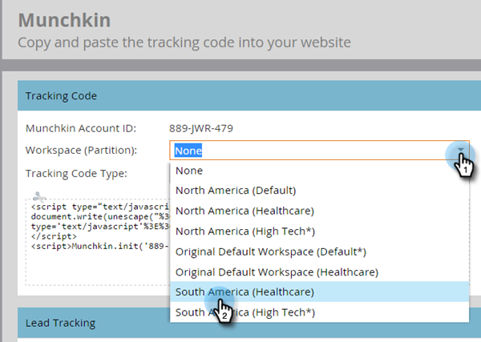
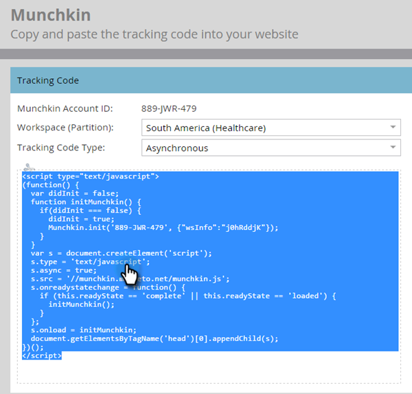
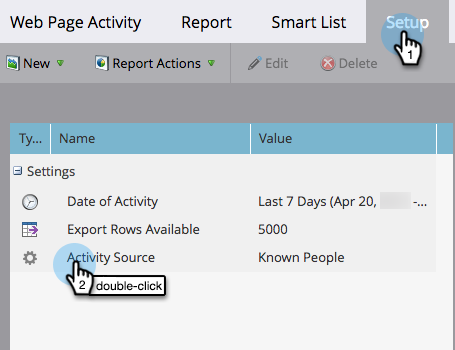

# Web サイトへの [!DNL Munchkin] トラッキングコードの追加 {#add-munchkin-tracking-code-to-your-website}

Marketo のカスタム JavaScript トラッキングコード（[!DNL Munchkin] コードと呼ばれる）は、自社の web サイトを訪問したすべての個人をトラッキングして、自動化されたマーケティングキャンペーンで訪問に応答できるようにします。 匿名の訪問者でも、IP アドレスなどの情報と共にトラッキングします。 **このトラッキングコードがなければ、web サイトへの訪問やその他のアクティビティをトラッキングできません**。

>[!PREREQUISITES]
>
>経験豊富なJavaScript開発者がアクセス可能であることを確認します。 Marketo テクニカルサポートでは、カスタム JavaScript のトラブルシューティングについては対応できません。

## Web サイトへのトラッキングコードの追加 {#add-tracking-code-to-your-website}

>[!NOTE]
>
>Adobe Experience Cloud ユーザは、[Adobe Launch の Marketo 統合](https://exchange.adobe.com/apps/ec/100223/adobe-launch-core-extension){target="_blank"}を使用して、web ページに [!DNL Munchkin] スクリプトを含めることもできます。 Adobe Launch を使用する場合、_[!DNL Munchkin] スクリプトは自動的に追加される_&#x200B;ため、自分で追加する必要はありません。

1. 「**[!UICONTROL 管理者]**」領域に移動します。

   

1. 「**[!UICONTROL Munchkin]**」をクリックします。

   

1. **[!UICONTROL トラッキングコードタイプ]**&#x200B;は「**[!UICONTROL 非同期]**」を選択します。

   

   >[!NOTE]
   >
   >ほとんどの場合、非同期コードを使用する必要があります。 [詳細情報](#types-of-munchkin-tracking-codes)

1. JavaScriptのトラッキングコードをコピーして、web サイトに追加します。

   

   >[!CAUTION]
   >
   >このスクリーンショットに示されているコードは使用しないでください。アカウントに表示される一意のコードを使用する必要があります。

   >[!TIP]
   >
   >トラッキングする web ページにトラッキングコードを貼り付けます。 規模が小さいサイトの場合は、ページごとに貼り付けることも可能です。または動的に生成される web ページ、ユーザーフォーラムなどが多数あるサイトの場合は、主なページに貼り付けるだけでかまいません。

   最適な結果を得るには、非同期 [!DNL Munchkin] コードを使用して、ページの `<head>` 要素内に配置します。 簡易コード（推奨しません）を使用する場合は、`</body>` タグの直前に貼りつけます。

   

   >[!TIP]
   >
   >トラフィック量が多いサイト（月に数十万回の訪問）の場合は、匿名のユーザーを追跡しないことを選択することをお勧めします。 [詳細情報](https://experienceleague.adobe.com/ja/docs/marketo-developer/marketo/javascriptapi/leadtracking/lead-tracking){target="_blank"}

## 複数のワークスペースを使用する場合のトラッキングコードの追加 {#add-tracking-code-when-using-multiple-workspaces}

Marketo アカウントでワークスペースを使用している場合は、ワークスペースに対応する個別のweb プレゼンスも使用している可能性があります。 その場合は、[!DNL Munchkin] トラッキングコードの JavaScript を使用して、適切なワークスペースおよびパーティションに匿名の人物を割り当てることができます。

1. 「**[!UICONTROL 管理者]**」領域に移動します。

   

1. 「**[!UICONTROL Munchkin]**」をクリックします。

   

1. トラッキングする web ページに適したワークスペースを選択します。

   

   >[!NOTE]
   >
   >特別なワークスペース [!DNL Munchkin] コードを使用しない場合、アカウントの設定時に作成された既定のパーティションにユーザーが割り当てられます。 既定では&#39;[!UICONTROL Default]&#39;という名前になっていますが、この名前は変更されている可能性があります。

1. **[!UICONTROL トラッキングコードタイプ]**&#x200B;は「**[!UICONTROL 非同期]**」を選択します。

   

1. JavaScriptのトラッキングコードをコピーして、web サイトに追加します。

   

   >[!CAUTION]
   >
   >このスクリーンショットに示されているコードは使用しないでください。アカウントに表示される一意のコードを使用する必要があります。

1. Web ページでトラッキングコードを貼り付ける場所は、`<head>` 要素内です。 このページにアクセスする新しいユーザーがこのパーティションに割り当てられます。

   

   >[!CAUTION]
   >
   >[!DNL Munchkin] のトラッキングスクリプトは、1 つのページの単一のパーティションおよびワークスペースに対して 1 つだけ使用できます。 Web サイトの複数のパーティション／ワークスペースに、トラッキングスクリプトを追加しないようにします。

   >[!NOTE]
   >
   >Marketoで作成されたランディングページには、トラッキングコードが自動的に含まれます。 このコードを追加する必要はありません。

## [!DNL Munchkin] トラッキングコードのタイプ {#types-of-munchkin-tracking-codes}

[!DNL Munchkin] トラッキングコードは、以下の 3 つのタイプから選択できます。 それぞれ、web ページの読み込み時間に対する影響が異なります。

1. **[!UICONTROL 簡易]**：コードの行数は最小限ですが、web ページの読み込み時間に関しては最適化されません。 このコードは、web ページを読み込むたびに jQuery ライブラリーを読み込みます。
1. **[!UICONTROL 非同期]**：web ページの読み込み時間が短くなります。
1. **[!UICONTROL 非同期 jQuery]**：web ページの読み込み時間が短くなり、システムのパフォーマンスも向上します。 既に jQuery があると想定し、チェックも読み込みも行いません。

## [!DNL Munchkin] コードのテスト {#test-if-your-munchkin-code-is-working}

[!DNL Munchkin] コードを追加した後で動作しているかどうかを確認するには：

1. Web ページにアクセスします。

1. [!DNL My Marketo] で、「**[!UICONTROL 分析]**」タイルをクリックします。

   

1. 「**[!UICONTROL Web ページアクティビティ]**」をクリックします。

   

1. 「**[!UICONTROL セットアップ]**」タブをクリックし、「**[!UICONTROL アクティビティソース]**」をダブルクリックします。

   

1. [!UICONTROL アクティビティソース]を「**[!UICONTROL 匿名の訪問者（ISP を含む）]**」に変更し、「**[!UICONTROL 適用]**」をクリックします。

   

1. 「**[!UICONTROL レポート]**」タブをクリックします。

   

   >[!NOTE]
   >
   >データが表示されない場合は、数分待ってから、下部にある「[!UICONTROL 更新]」アイコンをクリックします。
