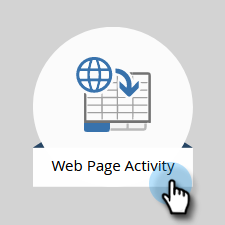

# 追加 [!DNL Munchkin] Web サイトへのトラッキングコード {#add-munchkin-tracking-code-to-your-website}

Marketo [!DNL Munchkin]は、Web サイトを訪問したすべての人を追跡するので、自動マーケティングキャンペーンを使用して訪問に反応できます。 匿名の訪問者でも、IP アドレスなどの情報と共にトラックします。**このトラッキングコードがなければ、web サイトへの訪問やその他のアクティビティをトラックできません**。

>[!PREREQUISITES]
>
>経験豊富な JavaScript 開発者の協力を得るようにしてください。Marketo テクニカルサポートでは、カスタム JavaScript のトラブルシューティングについては対応できません。

## Web サイトへのトラッキングコードの追加 {#add-tracking-code-to-your-website}

>[!NOTE]
>
>Adobe Experience Cloudのお客様は、Marketoの統合を Launch で使用して、 [!DNL Munchkin] スクリプトを Web ページに配置できます。 アプリを取得 [ここ](https://www.adobeexchange.com/experiencecloud.details.101054.html){target="_blank"}.

1. 「**[!UICONTROL 管理者]**」領域に移動します。

   

1. 「**[!UICONTROL Munchkin]**」をクリックします。

   

1. 選択 **[!UICONTROL 非同期]** 対象 **[!UICONTROL トラッキングコードタイプ]**.

   

   >[!NOTE]
   >
   >ほとんどの場合、非同期コードを使用します。[詳細情報](#types-of-munchkin-tracking-codes)

1. JavaScript のトラッキングコードをクリックしてコピーし、web サイトに貼り付けます。

   

   >[!CAUTION]
   >
   >このスクリーンショットのコードは使用しないでください。ご自身のアカウントに表示される固有のコードを使用する必要があります。

   >[!TIP]
   >
   >トラックする web ページにトラッキングコードを貼り付けます。規模が小さいサイトの場合は、ページごとに貼り付けることも可能です。または動的に生成される web ページ、ユーザフォーラムなどが多数あるサイトの場合は、主なページに貼り付けるだけでかまいません。

   最も良い結果を得るには、非同期 [!DNL Munchkin] コードを作成し、それを `<head>` ページの要素を含める必要があります。 簡易コード（推奨しません）を使用する場合は、`</body>` タグの直前に貼りつけます。

   

   >[!TIP]
   >
   >トラフィック量が非常に大きくなる（例：1 か月の訪問数が 10 万以上）サイトの場合、匿名リードを追跡することはお勧めしません。[詳細情報](https://developers.marketo.com/documentation/websites/lead-tracking-munchkin-js/)

## 複数のワークスペースを使用する場合のトラッキングコードの追加 {#add-tracking-code-when-using-multiple-workspaces}

Marketo アカウントで Workspaces を使用している場合、ワークスペースに対応した個々の web プレゼンスを使用していることも考えられます。その場合、 [!DNL Munchkin] 追跡 JavaScript ：匿名ユーザーを正しいワークスペースとパーティションに割り当てます。

1. 「**[!UICONTROL 管理者]**」領域に移動します。

   

1. 「**[!UICONTROL Munchkin]**」をクリックします。

   

1. トラックする web ページに対応するワークスペースを選択します。

   

   >[!NOTE]
   >
   >特別なワークスペースを使用しない場合 [!DNL Munchkin] コードを使用すると、アカウントの設定時に作成されたデフォルトのパーティションに担当者が割り当てられます。 名前は「[!UICONTROL デフォルト]「最初は」ですが、お客様自身のMarketoアカウントで変更した可能性があります。

1. 選択 **[!UICONTROL 非同期]** 対象 **[!UICONTROL トラッキングコードタイプ]**.

   

1. JavaScript のトラッキングコードをクリックしてコピーし、web サイトに貼り付けます。

   

   >[!CAUTION]
   >
   >このスクリーンショットのコードは使用しないでください。ご自身のアカウントに表示される固有のコードを使用する必要があります。

1. Web ページでトラッキングコードを貼り付ける場所は、`<head>` 要素内です。このページにアクセスした新しいリードは、このリードパーティションに割り当てられます。

   

   >[!CAUTION]
   >
   >1 つのみを使用できます [!DNL Munchkin] ページ上の単一のパーティションおよびワークスペースの追跡スクリプト。 Web サイトの複数のパーティション／ワークスペースに、トラッキングスクリプトを追加しないようにします。

   >[!NOTE]
   >
   >Marketo で作成したランディングページには、自動的にトラッキングコードが追加されるので、このコードを貼り付ける必要はありません。

## のタイプ [!DNL Munchkin] トラッキングコード {#types-of-munchkin-tracking-codes}

次の 3 つのタイプがあります。 [!DNL Munchkin] トラッキングコードを選択できます。 それぞれ、web ページの読み込み時間に対する影響が異なります。

1. **[!UICONTROL 簡易]**：コードの行数は最小限ですが、web ページの読み込み時間に関しては最適化されません。このコードは、web ページを読み込むたびに jQuery ライブラリーを読み込みます。
1. **[!UICONTROL 非同期]**：web ページの読み込み時間が短くなります。
1. **[!UICONTROL 非同期 jQuery]**：web ページの読み込み時間が短くなり、システムのパフォーマンスも向上します。既に jQuery があると想定し、チェックも読み込みも行いません。

## テスト対象 [!DNL Munchkin] コードが機能しています {#test-if-your-munchkin-code-is-working}

次の手順で [!DNL Munchkin] 追加後、コードは機能します。

1. Web ページにアクセスします。

1. を [!DNL My Marketo]、 **[!UICONTROL Analytics]** タイル。

   

1. 「**[!UICONTROL Web ページアクティビティ]**」をクリックします。

   

1. 「**[!UICONTROL セットアップ]**」タブをクリックし、「**[!UICONTROL アクティビティソース]**」をダブルクリックします。

   

1. を [!UICONTROL アクティビティソース] から **[!UICONTROL 匿名訪問者（ISP を含む）]** をクリックし、 **[!UICONTROL 適用]**.

   

1. 「**[!UICONTROL レポート]**」タブをクリックします。

   

   >[!NOTE]
   >
   >データが表示されない場合は、数分待ってから、下部にある更新アイコンをクリックします。
