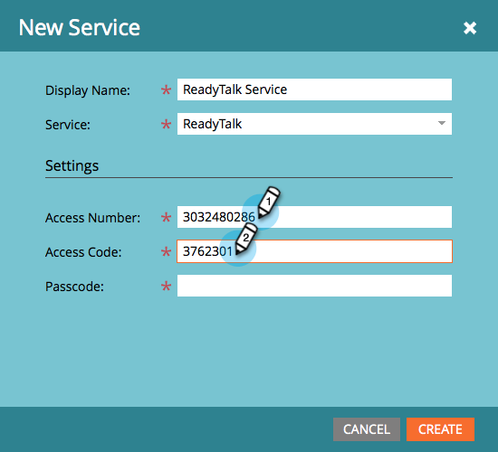
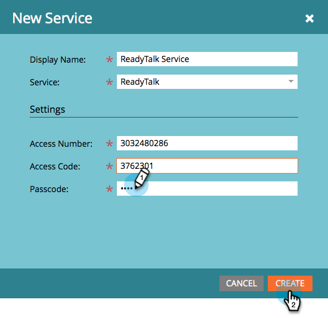

# LaunchPointサ追加ービス{#add-readytalk-as-a-launchpoint-service}としてのReadyTalk

ReadyTalkウェビナーの登録と出席状況は、Marketorが管理します。

>[!NOTE]
>
>**必要な管理者権限**

>[!NOTE]
>
>この手順では、ReadyTalkへの既存の購読と管理権限が必要です。 次の設定を手元に用意しておきます。アクセス番号、アクセスコード、パスコード。

1. **管理者**&#x200B;に移動し、**ReadyTalk**&#x200B;をクリックします。

   

1. 「**新規**」を選択し、「**新しいサービス**」を選択します。

   

1. **表示名**&#x200B;を入力します。 **サービス**&#x200B;の下で、**ReadyTalk**&#x200B;を選択します。

   

1. **アクセス番号**&#x200B;と&#x200B;**アクセスコード**&#x200B;を入力します。

   

1. **パスコード**&#x200B;を入力し、**作成**&#x200B;をクリックして、プロセスを完了します。

   

**ReadyTalk**&#x200B;アカウントは、Marketoと同期されます。

>[!MORELIKETHIS]
>
>[ReadyTalk](/help/marketo/product-docs/demand-generation/events/create-an-event/create-an-event-with-readytalk.md)でイベントを作成する方法を説明します。
