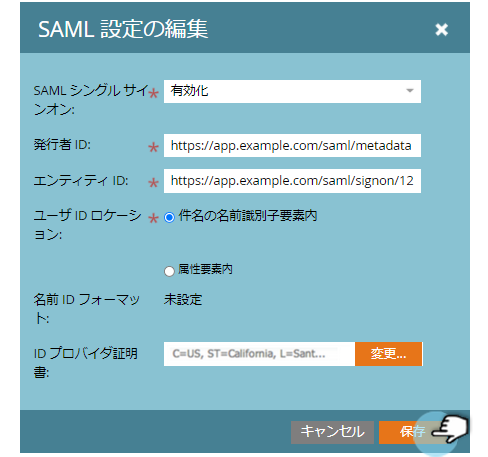

# ポータルへのシングルサインオンの追加 {#add-single-sign-on-to-a-portal}

ユーザーを認証するディレクトリサービスをご利用の場合は、Marketo へのシングルサインオン（SSO）を許可することができます。この機能をサポートするために、Security Assertion Markup Language（SAML）バージョン 2.0 以降を使用しています。

Marketo は SAML サービスプロバイダー（SP）として機能し、ユーザーの認証には外部 ID プロバイダー（IdP）を使用します。

SSO を有効にすると、IdP がユーザーの認証情報を検証できるようになります。ユーザーが Marketo ソフトウェアを使おうとすると、SP として機能する Marketo に対して IdP が署名済み SAML メッセージを送信します。このメッセージは、当該ユーザーが Marketo ソフトウェアの使用権限を持つことを Marketo に対して保証するものです。

>[!NOTE]
>
>**管理者権限が必要**

>[!NOTE]
>
>Microsoft Azure ユーザーですか？[統合チュートリアル](https://azure.microsoft.com/ja-jp/documentation/articles/active-directory-saas-marketo-tutorial/)をご覧ください。

## リクエストの送信方法 {#how-to-send-the-request}

* SAML 応答である SSO リクエストを `https://login.marketo.com/saml/assertion/<your-munchkin-id>` に送信します。
* SP のオーディエンス URL として次の URL を使用します。`http://saml.marketo.com/sp`
* SPNameQualifier 属性を使用している場合は、Subject の NameID 要素に次の値を設定します。`http://saml.marketo.com/sp`
* 複数の Marketo サブスクリプションを同じ SSO プロバイダーに統合する場合は、各 Marketo サブに対して `http://saml.marketo.com/sp/<munchkin_id>` 形式の一意の SP URL を使用できます

>[!NOTE]
>
>Marketo は、Identity Provider-initiated（IdP-initiated とも呼ばれます）のみをサポートします。この ID プロバイダーでは、ユーザーが最初に Idp ログインページを起動し、認証してから My Marketo に移動します。

## そのほかの備考 {#additional-notes}

* **同期時間** - 新しいユーザーの場合、最初の SSO リクエストが処理されるまでに約 10 分の遅延があります。
* **ユーザープロビジョニング** - ユーザーは Marketo を使用して手動でプロビジョニングします。
* **認証** - ユーザー権限は Marketo 内で維持されます。
* **OAuth サポート** - Marketo は現在 OAuth をサポートしていません。
* **自動ユーザー反映** - 「ジャストインタイムプロビジョニング」とも呼ばれ、ユーザーの最初の SAML ログインが、アクセスしている web アプリケーション（Marketo など）でユーザーを作成でき、手動の管理操作は不要です。現時点では、Marketo ではサポートされていません。
* **暗号化** - Marketo は現在暗号化をサポートしていません。

>[!NOTE]
>
>開始する前に、X.509 形式、および拡張子 .crt、.der、.cer のいずれかの形式で ID プロバイダーの証明書を用意します。

## SAML 設定の更新 {#update-saml-settings}

SSO はデフォルトで無効になっています。SAML を有効にして設定するには、次の手順に従います。

1. **管理**&#x200B;に移動し、「**シングルサインオン**」をクリックします。

   

   >[!NOTE]
   >
   >**管理者**&#x200B;の下に&#x200B;**シングルサインオン**&#x200B;が表示されない場合は、[Marketo サポート](https://nation.marketo.com/t5/Support/ct-p/Support)にお問い合わせください。

1. **SAML 設定**&#x200B;セクションで、「**編集**」をクリックします。

   

1. 「**SAML シングルサインオン**」を&#x200B;**有効**&#x200B;に変更します。

   

1. 「**発行者 ID**」、「**エンティティ ID**」を入力し、**ユーザー ID の場所**&#x200B;を選択して、「**参照**」をクリックします。

   

1. **ID プロバイダー証明書**&#x200B;ファイルを選択します。

   

1. 「**保存**」をクリックします。

   

## リダイレクトページ設定の更新 {#update-redirect-page-settings}

1. **ページをリダイレクト**&#x200B;セクションで、「**編集**」をクリックします。

   

   >[!NOTE]
   >
   >ユニバーサル ID と SSO を使用するお客様は、ID プロバイダーのログイン URL を「**ログイン URL**」フィールドに入力する必要があります。

1. 「**ログアウト URL**」を入力します。これは、Marketo からログアウトしたときにユーザーを転送する先の URL です。

   

1. 「**エラー URL**」を入力します。これは、Marketo へのログインが失敗した場合にユーザーを転送する先の URL です。「**保存**」をクリックします。

   

   >[!NOTE]
   >
   >これらのページは、どちらも一般公開されている必要があります。

>[!MORELIKETHIS]
>
>* [サブスクリプションログインでのユニバーサル ID の使用](/help/marketo/product-docs/administration/settings/using-a-universal-id-for-subscription-login.md)
>* [ユーザーログインを SSO のみに制限](/help/marketo/product-docs/administration/additional-integrations/restrict-user-login-to-sso-only.md)
>* [ユニバーサル ID を使用して、2 つのインスタンスに Marketo ユーザーを招待](https://nation.marketo.com/t5/Knowledgebase/Inviting-Marketo-Users-to-Two-Instances-with-Universal-ID-UID/ta-p/251122)

