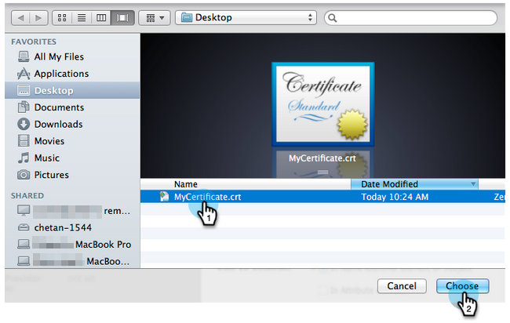

# ポータルへのシングルサインオンの追加 {#add-single-sign-on-to-a-portal}

ユーザーを認証するディレクトリサービスをご利用の場合は、Marketo へのシングルサインオン（SSO）を許可することができます。この機能をサポートするために、[!DNL Security Assertion Markup Language]（SAML）バージョン 2.0 以降を使用しています。

Marketo は SAML サービスプロバイダー（SP）として機能し、ユーザーの認証には外部 ID プロバイダー（IdP）を使用します。

SSO を有効にすると、IdP がユーザーの資格情報を検証できるようになります。ユーザーが Marketo ソフトウェアを使おうとすると、SP として機能する Marketo に対して IdP が署名済み SAML メッセージを送信します。このメッセージは、当該ユーザーが Marketo ソフトウェアの使用権限を持つことを Marketo に対して保証するものです。

>[!NOTE]
>
>**管理者権限が必要**

>[!IMPORTANT]
>
>これは、Adobe ID にオンボードされたサブスクリプションには適用されません。Adobe ID にオンボードされたサブスクリプションの場合、シングルサインオンは Adobe Admin Console のアドビ組織レベルで設定されます。[詳しくは、こちらを参照してください](https://helpx.adobe.com/enterprise/using/set-up-identity.html){target="_blank"}。

>[!NOTE]
>
>[!DNL Microsoft Azure] ユーザですか？詳しくは、[統合チュートリアル](https://azure.microsoft.com/ja-jp/documentation/articles/active-directory-saas-marketo-tutorial/){target="_blank"}を参照してください。参考までに、チュートリアルの手順 5c にタイプミスがあります。`https://<munchkinid>.marketo.com` **_ではなく_**、`https://<munchkinid>.mktoweb.com` を使用してください。

## リクエストの送信方法 {#how-to-send-the-request}

* SAML 応答である SSO リクエストを `https://login.marketo.com/saml/assertion/<your-munchkin-id>` に送信します。
* SP のオーディエンス URL として、`http://saml.marketo.com/sp` を使用します。
* SPNameQualifier 属性を使用している場合は、Subject の NameID 要素に `http://saml.marketo.com/sp` を設定します。
* 複数の Marketo サブスクリプションを同じ SSO プロバイダーに統合する場合は、各 Marketo サブに対して `http://saml.marketo.com/sp/<munchkin_id>` 形式の一意の SP URL を使用できます

>[!NOTE]
>
>Marketo は、Identity Provider-initiated（IdP-initiated とも呼ばれます）のみをサポートします。この ID プロバイダーでは、ユーザーが最初に Idp ログインページを起動し、認証してから My Marketo に移動します。

## そのほかの備考 {#additional-notes}

* **同期時間** - 新しいユーザーの場合、最初の SSO リクエストが処理されるまでに約 10 分の遅延があります。
* **ユーザープロビジョニング** - ユーザーは Marketo を使用して手動でプロビジョニングします。
* **認証** - ユーザー権限は Marketo 内で維持されます。
* **OAuth サポート** - Marketo は現在 OAuth をサポートしていません。
* **自動ユーザー反映** - 「ジャストインタイムプロビジョニング」とも呼ばれ、ユーザーの最初の SAML ログインが、アクセスしている web アプリケーション（Marketo など）でユーザーを作成でき、手動の管理操作は不要です。現時点では、Marketo ではサポートされていません。
* **暗号化** - Marketo は現在暗号化をサポートしていません。

>[!NOTE]
>
>開始する前に、X.509 形式、および拡張子 .crt、.der、.cer のいずれかの形式で ID プロバイダーの証明書を用意します。

## SAML 設定の更新 {#update-saml-settings}

SSO はデフォルトで無効になっています。SAML を有効にして設定するには、以下の手順に従います。

1. 「**[!UICONTROL 管理者]**」領域に移動します。

   

1. 「**[!UICONTROL シングルサインオン]**」をクリックします。

   

   >[!NOTE]
   >
   >**[!UICONTROL 管理者]**&#x200B;の下に&#x200B;**[!UICONTROL シングルサインオン]**&#x200B;が表示されない場合は、[Marketo サポート](https://nation.marketo.com/t5/Support/ct-p/Support){target="_blank"}にお問い合わせください。

1. 「**[!UICONTROL SAML 設定]**」セクションで、「**[!UICONTROL 編集]**」をクリックします。

   

1. 「**[!UICONTROL SAML シングルサインオン]**」を&#x200B;**[!UICONTROL 有効]**&#x200B;に変更します。

   

1. 「**[!UICONTROL 発行者 ID]**」、「**[!UICONTROL エンティティ ID]**」を入力し、**[!UICONTROL ユーザー ID の場所]**&#x200B;を選択して、「**[!UICONTROL 参照]**」をクリックします。

   

1. **[!UICONTROL ID プロバイダー証明書]**&#x200B;ファイルを選択します。

   

1. 「**[!UICONTROL 保存]**」をクリックします。

   

## リダイレクトページ設定の更新 {#update-redirect-page-settings}

1. 「**[!UICONTROL ページをリダイレクト]**」セクションで、「**[!UICONTROL 編集]**」をクリックします。

   

   >[!NOTE]
   >
   >ユニバーサル ID と SSO を使用するお客様は、ID プロバイダーのログイン URL を「**[!UICONTROL ログイン URL]**」フィールドに入力する必要があります。

1. 「**[!UICONTROL ログアウト URL]**」を入力します。これは、Marketo からログアウトしたときにユーザーを転送する先の URL です。

   

1. 「**[!UICONTROL エラー URL]**」を入力します。これは、Marketo へのログインが失敗した場合にユーザーを転送する先の URL です。「**[!UICONTROL 保存]**」をクリックします。

   

   >[!NOTE]
   >
   >これらのページは、どちらも一般公開されている必要があります。

>[!MORELIKETHIS]
>
>* [サブスクリプションログインでのユニバーサル ID の使用](/help/marketo/product-docs/administration/settings/using-a-universal-id-for-subscription-login.md){target="_blank"}
>* [ユーザーログインを SSO のみに制限](/help/marketo/product-docs/administration/additional-integrations/restrict-user-login-to-sso-only.md){target="_blank"}
>* [ユニバーサル ID を使用して Marketo ユーザを 2 つのインスタンスに招待](https://nation.marketo.com/t5/Knowledgebase/Inviting-Marketo-Users-to-Two-Instances-with-Universal-ID-UID/ta-p/251122){target="_blank"}
