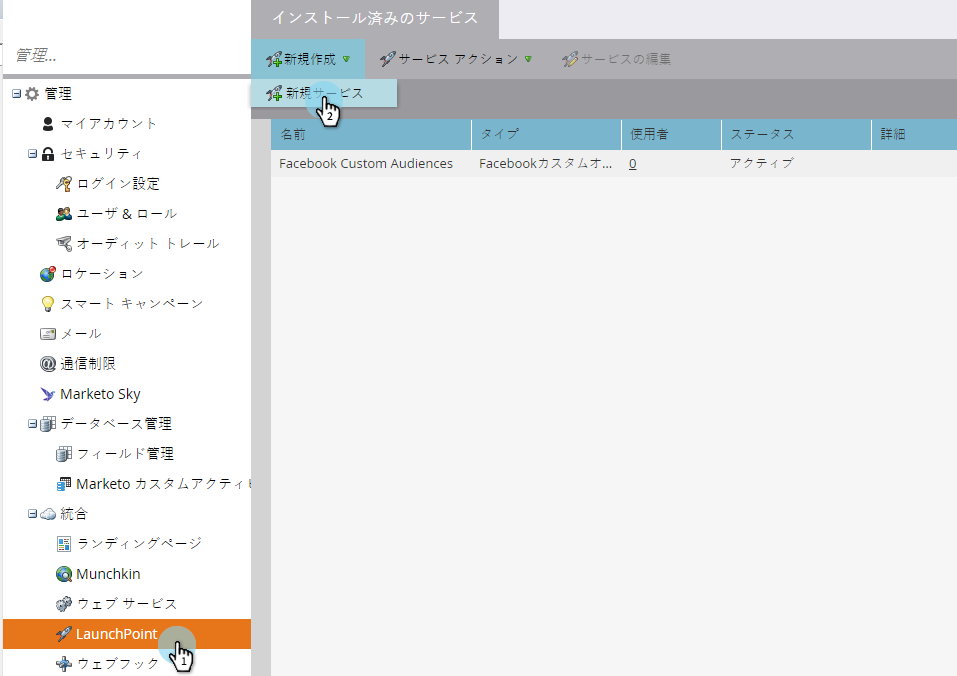

# LaunchPointサ追加ービス{#add-slack-as-a-launchpoint-service}としてのSlack

Slack統合には、次の2つの通知タイプが含まれます。

* **システム通知**:現在のキャンペーンのステータスや、直ちに対処する必要がある問題に関するアラート（CRMエラーおよびAPIの制限）など、Marketingインスタンスの重要なイベントに関するSlack通知を取得します。
* **興味深い瞬間**:Marketon Insightが営業アカウントから既知の個人によってトリガーされた場合、リードの所有者にはSlackを介して通知できます。通知には、リード情報と営業アカウントに関する詳細が含まれます。

>[!NOTE]
>
>**必要な管理者権限**

>[!PREREQUISITES]
>
>Slackシステム通知を既に有効にしていない場合は、[マーケティング担当者](https://nation.marketo.com/t5/Support/ct-p/Support)にお問い合わせください。

1. **LaunchPoint**&#x200B;に移動し、**新しい**&#x200B;の下にある&#x200B;**新しいサービス**&#x200B;をクリックします。

   

1. Slack統合の表示名を入力します。 「**サービス**」ドロップダウンで、「**Slack**」を選択します。 「**作成**」をクリックします。

   

1. 「**許可**」をクリックします。 Slackが新しいタブに開きます。このタブでは、認証を完了し、マーケティング担当者にSlackから情報を取得する権限を与えます。

   

1. 新しいSlackタブで、ワークスペースのURLを入力し、「**続行**」をクリックします。

   

1. Slackの資格情報を入力し、「**サインイン**」をクリックします。

   

1. 「**投稿先**」ドロップダウンで、マーケティングからの通知を投稿するチャネルを選択します。 要求された権限を確認し、「**許可**」をクリックします。

   

1. 次の確認画面が表示されます。 タブが自動的に閉じます。

   

1. 「マーケティング」タブを更新し、SlackがLaunchPointでアクティブなサービスとして表示されていることを確認します。

   

   通知は、手順6で選択したチャネルへの投稿を開始します。 次のようになります。

   
