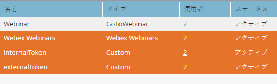

# [!DNL Webex] を [!DNL LaunchPoint] サービスとして追加 {#add-webex-as-a-launchpoint-service}

Marketo Engage は、[!DNL Webex] ウェビナーの登録と出席を管理します。[[!UICONTROL Webex]](https://www.webex.com/) に対する既存のサブスクリプションが必要です。

>[!NOTE]
>
>**管理者権限が必要**

1. 「**[!UICONTROL 管理者]**」領域に移動します。

   

1. **[!UICONTROL LaunchPoint]**.をクリックします。

   

1. 「**[!UICONTROL 新規]**」を選択し、次に「**[!UICONTROL 新規サービス]**」を選択します。

   

1. **[!UICONTROL 表示名]**&#x200B;を入力します。**[!UICONTROL サービス]**&#x200B;ドロップダウンで、「**[!UICONTROL Webex ウェビナー]**」を選択します。

   

1. 「**[!UICONTROL Webex ウェビナーにログイン]**」をクリックします。

   

1. Webex が新しいタブで開きます。Webex 資格情報を使用してログインします。

   

1. ログインに成功すると、タブが閉じ、Marketo Engage の&#x200B;_新しいサービス_&#x200B;モーダルに「Webex ウェビナーアカウントが設定されました」と表示されます。「**[!UICONTROL 作成]**」をクリックします。

   

**[!DNL Webex]** が Marketo と同期されました。

>[!MORELIKETHIS]
>
>[ [!DNL Webex]](/help/marketo/product-docs/demand-generation/events/create-an-event/create-an-event-with-webex.md){target="_blank"} でイベントを作成します。
