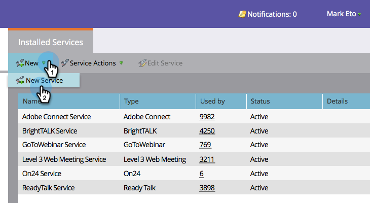
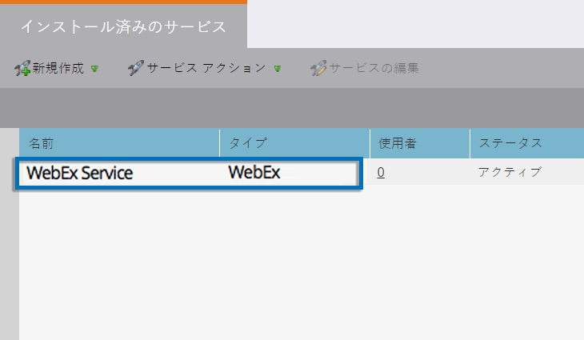

# WebEx を LaunchPoint サービスとして追加 {#add-webex-as-a-launchpoint-service}

Marketo は、WebEx のウェビナー登録と出席を管理します。

>[!NOTE]
>
>**管理者権限が必要**

>[!NOTE]
>
>この手順を実行するには、WebEX のサブスクリプションと管理者権限が必要です。ユーザー名、パスワード、サイト名の各設定をお手元にご用意ください。

>[!NOTE]
>
>サイト名は、WebEX にログインするときに使用する URL の末尾を見るとわかります。例：
>
>`https://mycompany.webex.com/mw0300lc/mywebex/default.do?siteurl=mycompany`
>
>注意：このフィールドに URL 全体を入力しないでください。サイト名のみを入力します。

1. **管理**&#x200B;に移動し、「**LaunchPoint**」をクリックします。

   

1. 「**新規**」を選択し、次に「**新規サービス**」を選択します。

   

1. **表示名**&#x200B;を入力します。「**サービス**」で、「**WebEx**」を選択します。

   

1. 「**ユーザー名**」と「**パスワード**」をそれぞれ入力します。

   

1. 「**サイト名**」を入力し、「**作成**」をクリックして、プロセスを完了します。

   

1. これで完了です。**WebEx** が Marketo と同期されました。

   

>[!MORELIKETHIS]
>
>[WebEx でイベントを作成する](/help/marketo/product-docs/demand-generation/events/create-an-event/create-an-event-with-webex.md)方法を参照してください。
