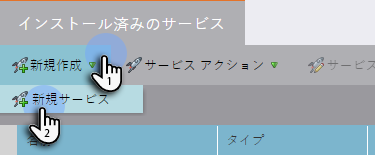
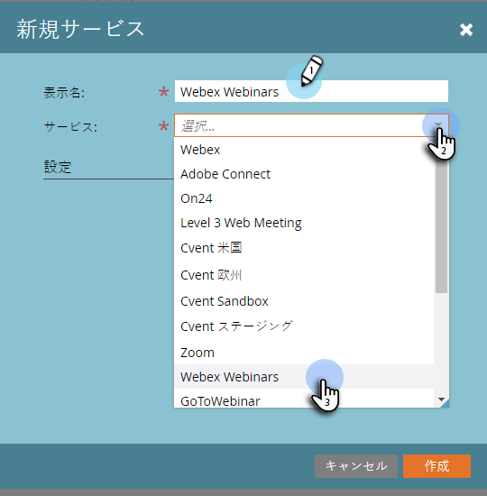
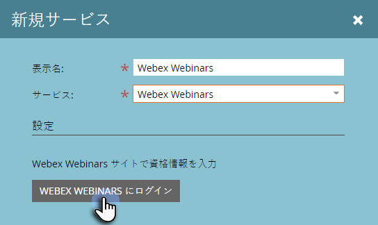
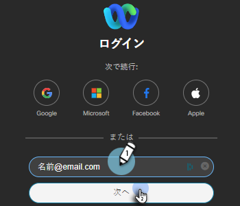
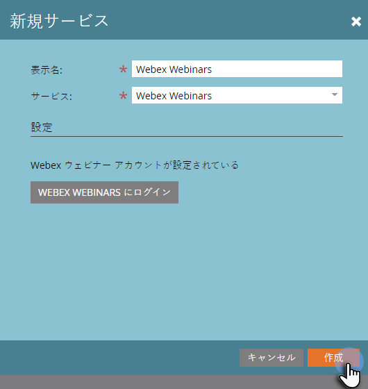

# Webex を LaunchPoint サービスとして追加 {#add-webex-as-a-launchpoint-service}

Marketo Engage は、Webex のウェビナー登録と出席を管理します。

>[!NOTE]
>
>**管理者権限が必要**

>[!NOTE]
>
>この手順を実行するには、Webex のサブスクリプションと管理者権限が必要です。ユーザ名、パスワード、サイト名の各設定をお手元にご用意ください。

>[!NOTE]
>
>サイト名は、Webex にログインするときに使用する URL の末尾を見るとわかります。例：
>
>`https://mycompany.webex.com/mw0300lc/mywebex/default.do?siteurl=mycompany`
>
>**注意：**&#x200B;このフィールドに URL 全体を入力しないでください。サイト名のみを入力します。

1. 「**管理者**」領域に移動します。

   

1. **LaunchPoint**.をクリックします。

   

1. 「**新規**」を選択し、次に「**新規サービス**」を選択します。

   

1. **表示名**&#x200B;を入力します。「**サービス**」で、「**Webex**」を選択します。

   

1. 「**ユーザ名**」と「**パスワード**」をそれぞれ入力します。

   

1. 「**サイト名**」を入力し、「**作成**」をクリックして、プロセスを完了します。

   

1. これで完了です。**Webex** が Marketo と同期されました。

   

>[!MORELIKETHIS]
>
>方法を学ぶ [Webex でのイベントの作成](/help/marketo/product-docs/demand-generation/events/create-an-event/create-an-event-with-webex.md){target=&quot;_blank&quot;}。
