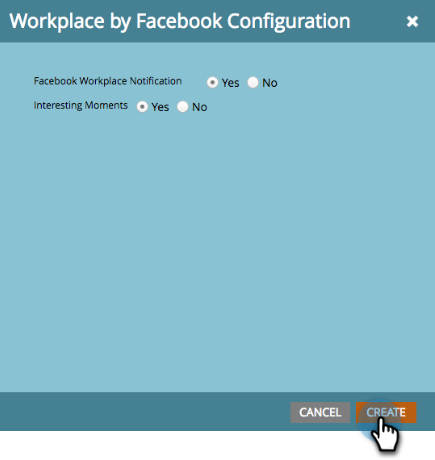

# Facebook による Workplace を LaunchPoint サービスとして追加 {#add-workplace-by-facebook-as-a-launchpoint-service}

Workplace 統合には、次の 2 つの通知タイプが含まれます。

* **システム通知**：現在のキャンペーンのステータスに関するアラートや、即座に対処する必要のある問題（CRM エラーおよび API 制限）など、Marketo インスタンスの重要なイベントに関する Workplace 通知を取得します。
* **注目のアクション**：Marketo Insight がセールスアカウントの既知の個人によってトリガーされた場合、リードの所有者は Workplace 経由で通知を受け取ることができます。通知には、リード情報とセールスアカウントに関する詳細が含まれます。

>[!NOTE]
>
>**管理者権限が必要**

>[!PREREQUISITES]
>
>Workplace 通知が有効になっていない場合は、 [Marketoサポート](https://nation.marketo.com/t5/Support/ct-p/Support){target=&quot;_blank&quot;}。

1. 「**管理者**」領域に移動します。

   

1. **LaunchPoint**.をクリックします。

   

1. 「**新規**」を選択し、次に「**新規サービス**」を選択します。

   

1. Workplace 統合の表示名を入力します。「**サービス**」ドロップダウンで、「**Facebook による Workplace**」を選択します。「**作成**」をクリックします。

   

1. システム通知や注目のアクションを受け取るには、オプションをそのままにしておきます。 「**作成**」をクリックします。

   

1. 「**承認**」をクリックします。これにより、新しいタブで Workplace が開くので、Workplace から情報を取り込むための認証を完了し、Marketo 権限を付与します。

   

1. 新しい「Workplace」タブで、ビジネスメールまたは Workplace のユーザー名を入力し、「**続行**」をクリックします。

   

1. Workplace 資格情報を入力し、「**ログイン**」をクリックします。

   

1. 「Workplace」ポップアップで、Marketo からの通知を投稿する Facebook グループを選択します（例：パートナー統合）。「**インストール**」をクリックします。

   

1. 次の確認通知が表示されます。タブが自動的に閉じます。

   

1. 「Marketo」タブを更新し、Workplace が LaunchPoint でアクティブなサービスとして表示されていることを確認します。

   

   手順 7 で選択した Facebook グループへの通知の投稿が開始されます。次のように表示されます。

   
