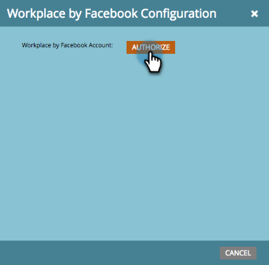

# LaunchPointサービスとしてのFacebook追加による職場 {#add-workplace-by-facebook-as-a-launchpoint-service}

Workplace統合には、次の2つの通知タイプが含まれます。

* **システム通知**:現在のキャンペーンのステータスや、直ちに対処する必要のある問題に関するアラート（CRMエラーおよびAPIの制限）など、Marketorインスタンスの重要なイベントに関するワークプレース通知を取得します。
* **興味深い瞬間**:Marketo Insightが営業アカウントから既知の個人によってトリガーされた場合、リードの所有者にはWorkplace経由で通知できます。 通知には、リード情報と営業アカウントに関する詳細が含まれます。

>[!NOTE]
>
>**必要な管理者権限**

>[!NOTE]
>
>**前提条件**
>
>職場通知が既に有効になっていない場合は、サポートに [お問い合わせください](http://docs.marketo.com/cdn-cgi/l/email-protection#5b282e2b2b34292f1b363a29303e2f3475383436)。

1. 「LaunchPoint **」に移動し、「** New **」の下にある「** New Service ****」をクリックします。

   

1. 職場統合の表示名を入力します。 「 **サービス** 」ドロップダウンで、「 **Workplace by Facebook**」を選択します。 「 **作成**」をクリックします。

   

1. システム通知や興味深い瞬間を受け取るには、そのままのオプションを使用します。 「 **作成**」をクリックします。

   

1. 「 **認証**」をクリックします。 これにより、新しいタブに職場が開きます。このタブで、認証を完了し、マーケティング担当者に職場から情報を取り込む権限を与えます。

   

1. 新しい「Workplace（職場）」タブで、勤務先の電子メールまたは職場のユーザー名を入力し、「 **続行**」をクリックします。

   

1. Workplaceの資格情報を入力し、「 **Log in**」をクリックします。

   

1. 職場ポップアップで、マーケティングからの通知を投稿するFacebookグループを選択します（例：パートナー統合）。 「 **インストール**」をクリックします。

   

1. 次の確認通知が表示されます。 タブが自動的に閉じます。

   

1. 「マーケティング」タブを更新し、WorkplaceがLaunchPointでアクティブなサービスとして表示されていることを確認します。

   

   手順7で選択したFacebookグループへの通知の投稿が開始されます。 次のようになります。

   

