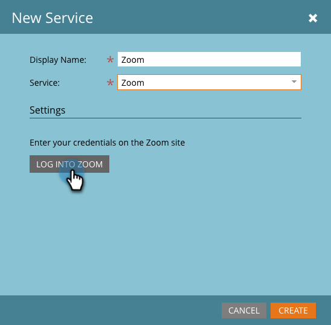

# Zoom を LaunchPoint サービスとして追加 {#add-zoom-as-a-launchpoint-service}

Marketo は、Zoom の登録と出席を管理します。

>[!NOTE]
>
>**管理者権限が必要**

>[!NOTE]
>
>この手順を実行するには、Zoom のサブスクリプションと管理者権限が必要です。Zoom のログインに使用するメールとパスワードをお手元にご用意ください。

1. 「**管理者**」領域に移動します。

   

1. **LaunchPoint**.をクリックします。

   

1. 「**新規**」を選択し、次に「**新規サービス**」を選択します。

   

1. **表示名**&#x200B;を入力します。「**サービス**」で、「**Zoom**」を選択します。

   

1. 「**Zoom にログイン**」をクリックします。

   

1. Zoom のログインウィンドウで、Zoom 資格情報を入力し、「**ログイン**」をクリックします。

   

1. ウィンドウが閉じたら、「**作成**」をクリックします。

   

   これで完了です。Zoom アカウントが Marketo と同期され、LaunchPoint 領域に表示されます。

>[!CAUTION]
>
>Zoom でパスワードを更新する場合は、Marketo でもパスワードを更新する必要があります。

>[!MORELIKETHIS]
>
>[Zoom でイベントを作成する](/help/marketo/product-docs/demand-generation/events/create-an-event/create-an-event-with-zoom.md)方法を参照してください。
