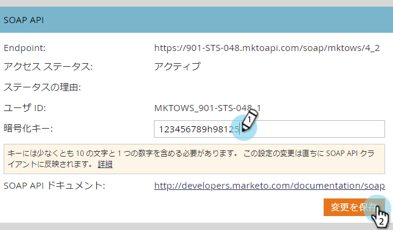

# SOAP API の設定 {#configuring-your-soap-api-settings}

>[!NOTE]
>
>REST API の使用をお勧めしています。詳細は、[developers.marketo.com](https://developers.marketo.com/documentation/rest/) を参照してください。

>[!NOTE]
>
>**管理者権限が必要**

1. **管理**&#x200B;に移動し、「**Web サービス**」をクリックします。

   

1. 「**暗号化キー**」に適切な値を設定し、「**変更を保存**」をクリックしたら、すべての情報を自社の開発者に伝えます。

   

>[!CAUTION]
>
>SOAP エンドポイントとユーザー ID は一意です。この記事のスクリーンショットを開発者に送信しないでください。

>[!MORELIKETHIS]
>
>[SOAP API ドキュメント](https://developers.marketo.com/documentation/soap/)
