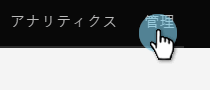
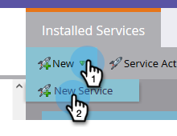
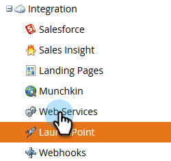

# BrightTALKをMarketoに接続{#connect-brighttalk-to-marketo}

BrightTALKチャネルをMarketoインスタンスに接続する方法を説明します。 これを行うには、両方の管理者である必要があります。

>[!NOTE]
>
>**必要な管理者権限**

## BrightTALK {#steps-in-brighttalk}のステップ

1. [business.brighttalk.com/demandcentral](http://business.brighttalk.com/demandcentral/login)にログインし、**今すぐ接続**&#x200B;をクリックします。
1. 「Advanced Marketto Connector」で、「**接続**」をクリックします。
1. 資格情報画面が開き、次の項目を確認します。クライアントID、クライアントシークレット、IDサービスURL、RESTサービスURL。 この情報を取得するには、Marketoにログインします。

## マーケティングの手順{#steps-in-marketo}

>[!NOTE]
>
>この時点で、BrightTALKがMarketoインスタンスに与える権限を制限するために、APIのみのユーザーロールとAPIユーザーを設定する必要があります。 この手順の記事は既にあるので、リンクします。

1. [APIのみのユーザーロール](/help/marketo/product-docs/administration/users-and-roles/create-an-api-only-user-role.md)を作成します。
1. [手順4で作成したBrightTALK APIロールを使用して](/help/marketo/product-docs/administration/users-and-roles/create-an-api-only-user.md)、APIユーザーを作成します。
1. 管理領域に戻ります。

   

1. 「統合」で、「**LaunchPoint**」をクリックします。

   

1. 「**新規**」ドロップダウンをクリックし、「**新規サービス**」を選択します。

   

1. 任意の表示名を入力します。 「サービス」ドロップダウンをクリックし、「カスタム&#x200B;**」を選択します（「BrightTALK」を選択しないで&#x200B;__ください）。**

   

   >[!CAUTION]
   >
   >ドロップダウンでBrightTALKを選択しないでください。 これは、削除中のフィールドです。選択すると、Marketto/BrightTALK統合に重大な問題が発生する可能性があります。

1. 選択した説明を入力します。 「APIのみのユーザー」ドロップダウンをクリックし、手順5で作成したBrightTALK APIユーザーを選択します。 「**作成**」をクリックします。

   

1. 先ほど作成したカスタムサービスの「**表示の詳細**」をクリックします。

   

1. **クライアントID**&#x200B;と&#x200B;**クライアントシークレット**&#x200B;をコピー（保存）します。 「**閉じる**」をクリックします。

   

1. 「Integration」で、「**Web Services**」を選択します。

   

1. Rest APIの下で、**エンドポイント**&#x200B;と&#x200B;**ID**&#x200B;をコピー（および保存）します。

   

## BrightTALK {#additional-steps-in-brighttalk}の追加手順

1. 手順3からBrightTALKコネクタの設定画面に戻り、手順12と14で保存した資格情報を入力します。

   秘密鍵証明書が認証されると、BrightTALKがMarketoに正式に接続されます。 次のステップは、[同期するデータフィールドを](http://support.brighttalk.com/hc/en-us/articles/115005131274-BrightTALK-Connector-for-Marketo-Choose-the-Fields-to-Sync)決定することです。
