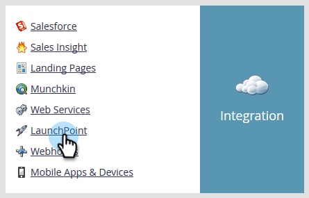

# [!DNL BrightTALK] の Marketo への接続 {#connect-brighttalk-to-marketo}

[!DNL BrightTALK] チャネルを Marketo インスタンスに接続する方法を説明します。これを行うには、両方の管理者である必要があります。

>[!NOTE]
>
>**管理者権限が必要**

## [!DNL BrightTALK] での手順 {#steps-in-brighttalk}

1. [business.brighttalk.com/demandcentral](https://business.brighttalk.com/demandcentral/login){target="_blank"} にログインし、「**[!UICONTROL 今すぐ接続]**」をクリックします。
1. 「[!UICONTROL Marketo コネクタの詳細設定]」で、「**[!UICONTROL 接続]**」をクリックします。
1. 資格情報画面が表示され、クライアント ID、クライアントシークレット、ID サービス URL、REST サービス URL の情報が求められます。この情報を取得するには、Marketo にログインします。

## Marketo での手順 {#steps-in-marketo}

>[!NOTE]
>
>この時点で、[!DNL BrightTALK] が Marketo インスタンスに持つ権限を制限するために、[!DNL API Only User Role] と [!DNL API User] を設定する必要があります。これらの手順に関する記事が既にあり、以下が記事のリンクです。

1. [API 専用ユーザーロール](/help/marketo/product-docs/administration/users-and-roles/create-an-api-only-user-role.md){target="_blank"}を作成する。

1. 手順 4 で作成した [!DNL BrightTALK] API ロールを使用して、[API ユーザーを作成](/help/marketo/product-docs/administration/users-and-roles/create-an-api-only-user.md){target="_blank"}します。

1. **[!UICONTROL 管理]**&#x200B;領域に戻ります。

   

1. 「**[!UICONTROL 統合]**」で、「**[!UICONTROL LaunchPoint]**」をクリックします。

   

1. **[!UICONTROL 新規]**&#x200B;ドロップダウンをクリックして、**[!UICONTROL 新規サービス]**&#x200B;を選択します。

   

1. 任意の&#x200B;**[!UICONTROL 表示名]**&#x200B;を入力します。**[!UICONTROL サービス]**&#x200B;ドロップダウンをクリックし、**[!UICONTROL カスタム]**&#x200B;を選択します（[!DNL BrightTALK] は&#x200B;_選択しません_）。

   

   >[!CAUTION]
   >
   >ドロップダウンの [!DNL BrightTALK] は選択しないでください。これは削除中のフィールドで、選択すると、[!DNL Marketo/BrightTALK] 統合に重大な問題が発生する可能性があります。

1. 任意の「[!UICONTROL 説明]」を入力します。**[!UICONTROL API 専用ユーザー]**&#x200B;ドロップダウンをクリックし、手順 5 で作成した [!DNL BrightTALK API User] を選択します。「**[!UICONTROL 作成]**」をクリックします。

   

1. 先ほど作成したカスタムサービスの「**[!UICONTROL 詳細を表示]**」をクリックします。

   

1. **[!UICONTROL クライアント ID]** および&#x200B;**[!UICONTROL クライアントシークレット]**&#x200B;をコピー（および保存）します。「**[!UICONTROL 閉じる]**」をクリックします。

   

1. 「**[!UICONTROL 統合]**」で、「**[!UICONTROL Web サービス]**」を選択します。

   

1. **[!UICONTROL Rest API]** で、**[!UICONTROL エンドポイント]**&#x200B;および **[!UICONTROL ID]** をコピー（および保存）します。

   

## [!DNL BrightTALK] での追加手順 {#additional-steps-in-brighttalk}

1. 手順 3 の [!DNL BrightTALK] コネクタの設定画面に戻り、手順 12 および 14 で保存した資格情報を入力します。

資格情報が認証されたら、[!DNL BrightTALK] が Marketo に正式に接続されています。次の手順では、同期するデータフィールドを決定します。 サポートが必要な場合は、サポート [BrightTALK](https://www.brighttalk.com/){target="_blank"} までお問い合わせください。
