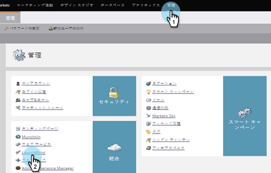
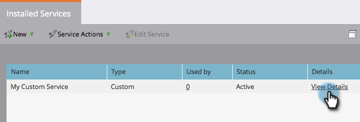

# ReST API で使用するカスタムサービスの作成 {#create-a-custom-service-for-use-with-rest-api}

Marketo との統合に ReST API を使用する場合、カスタムサービスの作成をお勧めします。手順は以下のとおりです。

>[!PREREQUISITES]
>
>* [API のみのユーザーの役割を作成](/help/marketo/product-docs/administration/users-and-roles/create-an-api-only-user-role.md)
>* [API のみのユーザーを作成](/help/marketo/product-docs/administration/users-and-roles/create-an-api-only-user.md)

>

>[!NOTE]
>
>**管理者権限が必要**

>[!TIP]
>
>[ReST API](https://developers.marketo.com/documentation/rest/) の詳細については、開発者向けドキュメントを参照してください。必要に応じて、[SOAP API](https://developers.marketo.com/documentation/soap/) も用意しています。

>[!NOTE]
>
>Spark レベルの Marketo の場合、カスタムサービスを作成することはできません。

## カスタムサービスの作成 {#create-custom-service}

1. **管理**&#x200B;に移動し、「**LaunchPoint**」をクリックします。

   

1. 「**新規作成**」の下の「**新規サービス**」をクリックします。

   

1. サービスの「**表示名**」を入力します。**先ほど作成した**「[API のみのユーザー](/help/marketo/product-docs/administration/users-and-roles/create-an-api-only-user.md)」を選択します。

   >[!NOTE]
   >
   >一般的なウェビナーサービスに対しては、既にネイティブ統合が行われています。

   

1. 「**作成**」をクリックします。

   

   これでサービスが作成されました。次に、アクセス用の認証情報をすべて取得します。

## API アクセスの認証情報 {#credentials-for-api-access}

1. **管理**&#x200B;に移動し、「**LaunchPoint**」をクリックします。

   

1. 上記で作成したカスタム LaunchPoint サービスの「**詳細を表示**」をクリックします。

   

1. 「**トークンを取得**」をクリックします。

   

1. 接続を確立する担当者に、**クライアント ID**、**クライアントシークレット**、**許可されたユーザー**、**トークン**&#x200B;を提供します。

   

>[!CAUTION]
>
>これらの情報は共有しないでください。データの裏の侵入経路になります。安全な取り扱いを心がけてください。
