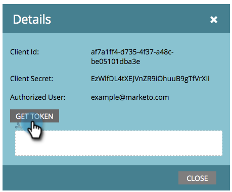

# ReST API で使用するカスタムサービスの作成 {#create-a-custom-service-for-use-with-rest-api}

Marketo との統合に ReST API を使用する場合、カスタムサービスの作成をお勧めします。手順は次のとおりです。

>[!PREREQUISITES]
>
>* [API 専用ユーザーのロールの作成](/help/marketo/product-docs/administration/users-and-roles/create-an-api-only-user-role.md)
>* [API 専用ユーザーの作成](/help/marketo/product-docs/administration/users-and-roles/create-an-api-only-user.md)
>

>[!NOTE]
>
>**管理者権限が必要**

>[!TIP]
>
>[REST API](https://developer.adobe.com/marketo-apis/) について詳しくは、開発者向けドキュメントを参照してください。必要に応じて、[SOAP API](https://experienceleague.adobe.com/ja/docs/marketo-developer/marketo/soap/soap-api) も用意しています。

## カスタムサービスの作成 {#create-custom-service}

1. 「**[!UICONTROL 管理者]**」領域に移動します。

   

1. **LaunchPoint**.をクリックします。

   

1. 「**[!UICONTROL 新規]**」を選択し、次に「**[!UICONTROL 新規サービス]**」を選択します。

   

1. サービスの「**[!UICONTROL 表示名]**」を入力します。**[!UICONTROL 先ほど作成した]**「[API 専用ユーザー](/help/marketo/product-docs/administration/users-and-roles/create-an-api-only-user.md)」を選択します。

   

   >[!NOTE]
   >
   >一般的なウェビナーサービスに対しては、既にネイティブ統合が行われています。

1. 「**[!UICONTROL 作成]**」をクリックします。

   

   これでサービスが作成されました。次に、アクセス用のすべての資格情報を取得します。

## API アクセスの資格情報 {#credentials-for-api-access}

1. 「**[!UICONTROL 管理者]**」領域に移動します。

   

1. **[!UICONTROL LaunchPoint]**.をクリックします。

   

1. 上記で作成したカスタム [!UICONTROL LaunchPoint] サービスの「**[!UICONTROL 詳細を表示]**」をクリックします。

   

1. 「**[!UICONTROL トークンを取得]**」をクリックします。

   

1. 接続を確立する担当者に、**[!UICONTROL クライアント ID]**、**[!UICONTROL クライアントシークレット]**、**[!UICONTROL 許可されたユーザー]**、**[!UICONTROL トークン]**&#x200B;を提供します。

   

>[!CAUTION]
>
>これらの情報は共有しないでください。データの裏の侵入経路になります。安全な取り扱いを心がけてください。
