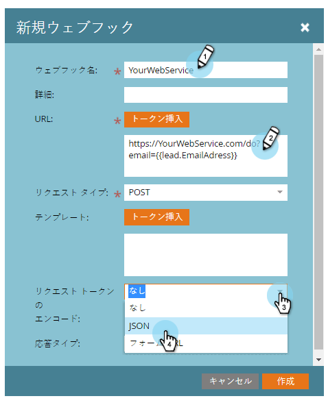
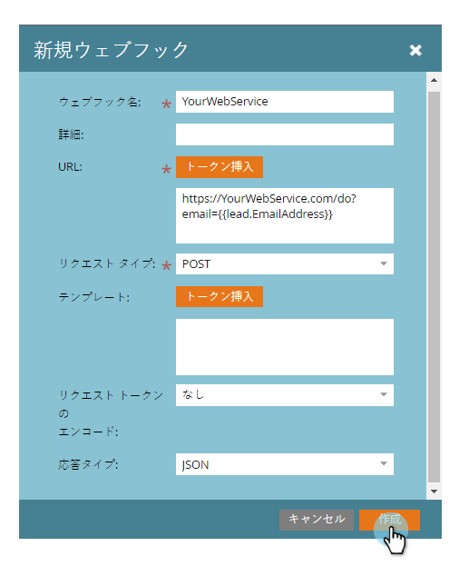

# Webフックの作成 {#create-a-webhook}

Webフックを使用して、サードパーティのWebサービスを利用し、テキストメッセージの送信、個人データの拡張などを行います。

>[!NOTE]
>
>**可用性**
>
>この機能を購入していないお客様もいます。 詳細については、セールス担当者にお問い合わせください。

1. 「**Admin **」に移動し、「 **Webhooks**」をクリックします。

   

1. 「 **新規Webフック**」をクリックします。

   

1. Webフックに名前を付け、設定します。

   

   >[!NOTE]
   >
   >これには、多くの場合、サードパーティのサービス資格情報をURLパラメーターとして、またはPOSTテンプレートに入力することが含まれます。

   * **URL**:Webサービスに対する要求のPOSTに使用するURLを入力します。 ユーザーの電子メールアドレス(**`{{lead.Email Address}}`**)などのトークンをリクエストに挿入するには、「トークンの **挿入**」をクリックします。

   * **テンプレート**:POSTの本文に情報を送信する場合は、テンプレートを入力します。 XML、JSON、SOAPなど、HTTPPOSTをサポートする任意のデータ形式を使用します。 テンプレートにトークンを挿入するには、「トークンの **挿入**」をクリックします。

   * **Request Token Encoding**:トークン値に特殊文字（アンパサンド、「&amp;」など）が含まれる場合は、リクエストの形式(**JSON** 、 **フォーム**/URL)を示します。

   * **応答タイプ**:サービスから受け取る応答の形式(**JSON** または **XML**)を選択します。

   「作成」をクリックします。

   

>[!NOTE]
>
>**ディープダイブ**
>
>詳しくは、 [Webhooks](http://developers.marketo.com/documentation/webhooks/) deep diveを参照してください。

