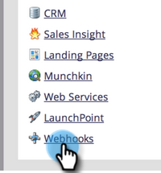

# [!DNL Webhook] の作成 {#create-a-webhook}

[!DNL Webhooks] を使用すると、サードパーティの web サービスを活用して、テキストメッセージの送信、人物データの拡張などを行うことができます。

1. 「**[!UICONTROL 管理者]**」領域に移動します。

   

1. 「**[!UICONTROL Webhook]**」をクリックします。

   

1. 「**[!UICONTROL 新規 Webhook]**」をクリックします。

   

1. [!DNL Webhook] に名前を付けて、設定します。

   

   >[!NOTE]
   >
   >多くの場合、使用するサードパーティのサービス資格情報を、URL パラメーターとして、または POST テンプレートに入力して含めます。

   * **[!UICONTROL URL]**：Web サービスに対するリクエストで使用する URL を入力します。 人物のメールアドレス（**`{{lead.Email Address}}`**）などのトークンをリクエストに挿入するには、「**[!UICONTROL トークンを挿入]**」をクリックします。

   * **[!UICONTROL テンプレート]**: リクエストの本文に情報を送信する場合は、ペイロードテンプレートを使用して入力します。 リクエストタイプ POST、DELETE、PATCH または PUT に対して許可されたテンプレート。 JSON や XML などのデータ形式を使用できます。 テンプレートにトークンを挿入するには、「**[!UICONTROL トークンを挿入]**」をクリックします。

   * **[!UICONTROL リクエストトークンのエンコード]**：トークンの値に特殊文字（アンパサンド「&amp;」など）が含まれる場合は、リクエストの形式（**JSON** または&#x200B;**フォーム／URL**）を指定します。

   * **[!UICONTROL 応答タイプ]**：サービスから受け取る応答の形式（**JSON** または **XML**）を選択します。

   * **[!UICONTROL リクエストタイプ]**：使用する HTTP メソッド（DELETE、GET、PATCH、POST、PUT）を選択します。

1. 「**[!UICONTROL 作成]**」をクリックします。

   

>[!NOTE]
>
>詳しくは、[[!DNL Webhooks]](https://experienceleague.adobe.com/ja/docs/marketo-developer/marketo/webhooks/webhooks){target="_blank"}の詳細をご覧ください。
