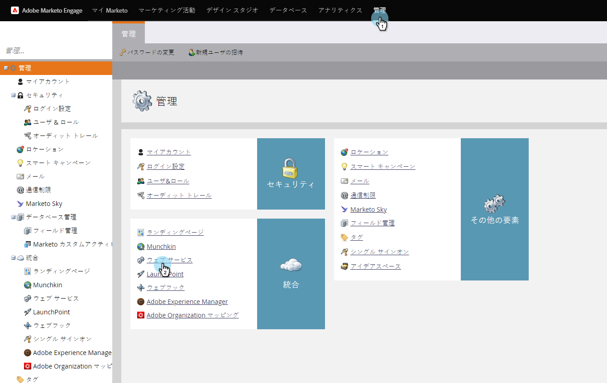
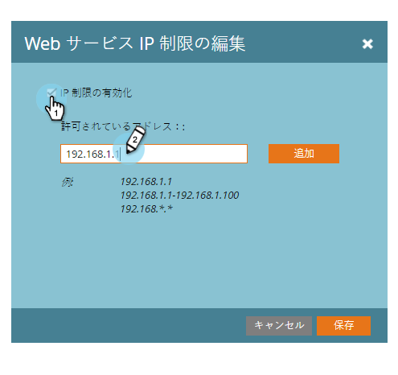

# IPベースのAPIアクセス用の許可リストの作成{#create-an-allowlist-for-ip-based-api-access}

特定のIPアドレスまたはアドレスの範囲に対してのみAPIアクセスを許可したい場合があります。 これを行うには、まず制限を有効にしてから、APIの使用を許可するIPアドレスを指定します。

>[!NOTE]
>
>**必要な管理者権限**

1. **管理者**&#x200B;に移動し、**Webサービス**&#x200B;をクリックします。

   

1. 「IP Restrictions」領域で、「**編集，**」をクリックするか、左上の「**IP制限の編集**」をクリックします。

   

1. 「**IP制限を有効にする**」ボックスをオンにし、許可リストするIPアドレスを入力します。

   

   >[!NOTE]
   >
   >単一のIPアドレスまたはその範囲を入力するか、ワイルドカードを使用できます。

1. **追加**&#x200B;をクリックして追加のフィールドを開き、IPアドレスを入力します。

   

1. 「**保存**」をクリックします。

   
