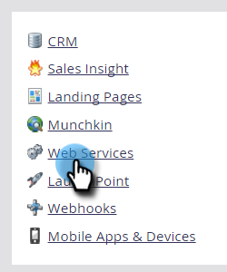

# IP ベースの API アクセス用の許可リストの作成 {#create-an-allowlist-for-ip-based-api-access}

特定の IP アドレスまたは IP アドレスの範囲に対してのみ API アクセスを許可したい場合があります。 まず制限を有効にしてから、API を使用できる IP アドレスを指定します。

>[!NOTE]
>
>**管理者権限が必要**

1. 「**[!UICONTROL 管理者]**」領域に移動します。

   

1. 「**[!UICONTROL Web サービス]**」をクリックします。

   

1. 「**[!UICONTROL IP 制限]**」領域で、「**[!UICONTROL 編集]**」をクリックするか、左上の「**[!UICONTROL IP 制限を編集]**」をクリックします。

   

1. 「**[!UICONTROL IP 制限を有効にする]**」ボックスを確認し、許可リストに追加する IP アドレスを入力します。

   

   >[!NOTE]
   >
   >単一の IP アドレスまたはその範囲を入力するか、ワイルドカードを使用できます。

1. 「**[!UICONTROL 追加]**」をクリックして追加のフィールドを開き、さらに IP アドレスを入力します。

   

1. 「**[!UICONTROL 保存]**」をクリックします。

   
