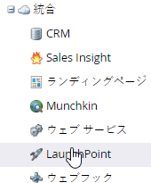

# Google Adwords アクティビティログのダウンロード {#download-googleadwords-activity-log}

インシデントは発生するものです。問題のトラブルシューティングには、アクティビティログのダウンロードが必要な場合があります。

1. 「**管理者**」領域に移動します。

   

1. **LaunchPoint**.をクリックします。

   

1. Google AdWords サービスを探し、「**アクティビティログをダウンロード**」をクリックします。

   

1. .zip ファイルがお使いのコンピューターにダウンロードされます。
