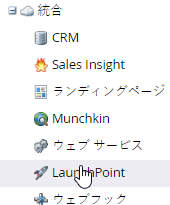

# [!DNL Google Adwords] アクティビティログのダウンロード {#download-googleadwords-activity-log}

インシデントは発生するものです。問題のトラブルシューティングには、アクティビティログのダウンロードが必要な場合があります。

1. 「**[!UICONTROL 管理者]**」領域に移動します。

   

1. **[!UICONTROL LaunchPoint]**.をクリックします。

   

1. [!DNL Google AdWords] サービスを探し、「**[!UICONTROL アクティビティログをダウンロード]**」をクリックします。

   

1. .zip ファイルがお使いのコンピューターにダウンロードされます。
