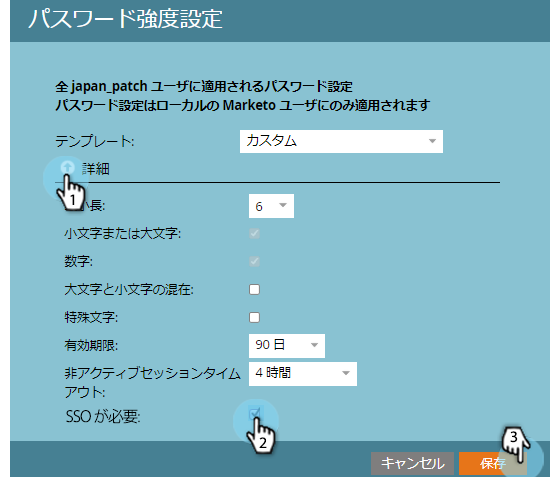

# ユーザーログインを SSO のみに制限 {#restrict-user-login-to-sso-only}

[SSO を使用していて](/help/marketo/product-docs/administration/additional-integrations/add-single-sign-on-to-a-portal.md)、ユーザーが SSO セキュリティをバイパスできないようにする場合は、次の手順に従います。

>[!NOTE]
>
>**管理者権限が必要**

1. 「**管理**」に移動し、「**ログイン設定**」をクリックします。

   

1. 「**セキュリティ設定を編集**」をクリックします。

   

1. 「詳細設定」を展開し、「**SSO が必要**」をオンにして、「**保存**」をクリックします。

>[!NOTE]
>
>ベストプラクティスは、ユーザーを招待して、ユーザーが招待を受け入れることです。ユーザーが招待を&#x200B;_受け入れた後_&#x200B;に、管理者は、「SSO が必要」に設定する必要があります。

>[!TIP]
>
>「**SSO が必要**」を選択した場合は、役割の設定時に「[シングルサインオンをバイパス](/help/marketo/product-docs/administration/users-and-roles/create-delete-edit-and-change-a-user-role.md)」オプションをオンにすることで、この制限から&#x200B;**ユーザーの役割**&#x200B;を除外できます。これにより、ユーザーは通常どおりにログインできます。例えば、管理者ユーザーは、引き続きログイン画面から Marketo にログインする必要が生じる場合があります。

>[!CAUTION]
>
>新しいユーザーを招待すると、ユーザーに招待メールが届きます。ただし、「**SSO が必要**」が選択されている場合は、「**シングルサインオンをバイパス**」に設定されている役割に割り当てられていない限り、招待メールは届きません。

これで完了です。これで、すべてのユーザーが、SSO ログインのみを使用するように制限されます（シングルサインオンをバイパスする権限を持つユーザーを除く）。

>[!MORELIKETHIS]
>
>* [ポータルへのシングルサインオンの追加](/help/marketo/product-docs/administration/additional-integrations/add-single-sign-on-to-a-portal.md)
>* [サブスクリプションログインでのユニバーサル ID の使用](/help/marketo/product-docs/administration/settings/using-a-universal-id-for-subscription-login.md)
>* [ユニバーサル ID を使用して、2 つのインスタンスに Marketo ユーザーを招待](https://nation.marketo.com/t5/Knowledgebase/Inviting-Marketo-Users-to-Two-Instances-with-Universal-ID-UID/ta-p/251122)

