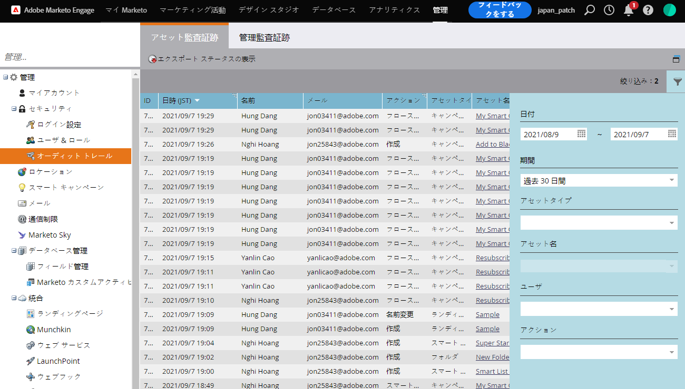
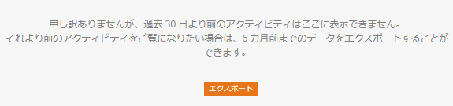

# 監査証跡の概要 {#audit-trail-overview}

監査証跡を使用すると、Marketorインスタンス内で行われた変更の完全な履歴（6か月分の値）を取得できます。

>[!NOTE]
>
>監査証跡データ履歴は、2016年9月14日から開始されました。

## 監査証跡とは {#what-is-audit-trail}

監査証跡は、マーケティング・購読内で発生するアクションとイベントの包括的なリストをリアルタイムでキャプチャします。 6か月のデータ履歴にアクセスして次のような質問に答えるセルフサービスを提供します。

このアセットまたは設定はどうなりましたか。また、最後に更新したのは誰ですか。

Xが何を企んでいるか

アカウントにログインしているユーザー

## 監査内容 {#what-we-audit}

Marketorは、次の [作成、編集および削除](http://docs.marketo.com/display/DOCS/Change+Details+in+Audit+Trail) ・アクションを監査します。

* Design Studioアセット
* すべてのマーケティングプログラム
* スマートキャンペーン
* リスト（スマート/静的）
* ユーザー(admin)
* ロールと権限(admin)
* ワークスペースとパーティション(admin)
* ユーザーログイン履歴

>[!NOTE]
>
>現時点では、Webパーソナライゼーション、予測コンテンツまたは販売インサイト内で行われた変更を **監査することはできません** 。

## 監査証跡コンポーネント {#audit-trail-components}

監査証跡は、3つのコンポーネントで構成されます。

**(1) [資産監査証跡](http://docs.marketo.com/display/DOCS/Change+Details+in+Audit+Trail#ChangeDetailsinAuditTrail-AssetAuditTrail)**

特定のアセットに対するアクティビティの実行を参照してください。

**2) [管理監査証跡](http://docs.marketo.com/display/DOCS/Change+Details+in+Audit+Trail#ChangeDetailsinAuditTrail-AdminAuditTrail)**

ユーザーベースの詳細を監視します。

**3) [ユーザログイン履歴](http://docs.marketo.com/display/DOCS/User+Login+History)**

購読にログインしているユーザーとログインしているタイミングを確認する。 失敗したログイン試行も含まれます。

>[!TIP]
>
>監査証跡を使用して監査できる数が非常に多いので、 [フィルタリングを必ず利用してください](http://docs.marketo.com/display/DOCS/Filtering+in+Audit+Trail)。

## データのエクスポート {#exporting-data}

インスタンスでは、30日分のデータのみを表示できます。 6か月分の値を取得するには、エクスポートオプションを使用します。

>[!NOTE]
>
>**定義**
>
>**不明：** 監査証跡で、ユーザーの名前と電子メールが「不明」と表示される場合があります。 これは、CRMの選択リストの値を変更した場合に発生します。 これらの値は、Marketing Formsおよびランディングページに表示されます。 CRM側でこの更新を行うと、フォームを参照するランディングページが自動ドラフトされます。 監査証跡では、ランディングページがドラフトされたことをキャプチャしますが、CRM側からユーザー情報を取り込めないので、ユーザーの名前と電子メールには「不明」と表示されます。

>[!NOTE]
>
>**関連記事**
>
>* [監査証跡の有効化](enable-audit-trail.md)

>

