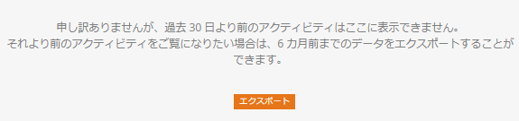

# 監査記録の概要 {#audit-trail-overview}

監査記録は、Marketo インスタンスで行った変更の詳細な履歴（6 か月分）を取得する機能です。

>[!NOTE]
>
>監査記録のデータ履歴は、2016年9月14日（PT）に始まります。

## 監査記録とは {#what-is-audit-trail}

監査記録は、Marketo サブスクリプションで発生するアクションとイベントの総合的なリストをリアルタイムで取得します。 セルフサービス方式で、6 か月の履歴データにアクセスし、以下のような質問に答えることに役立ちます。

「このアセットや設定はどうなったか、最後に更新したのは誰か？」

「ユーザーXは何をしてきたのですか？」

「誰が私たちの口座にログインしているんですか？」

## 監査の対象 {#what-we-audit}

Marketoは、次の[作成、編集、削除](/help/marketo/product-docs/administration/audit-trail/change-details-in-audit-trail.md) アクションを監査します。

* デザインスタジオのアセット
* すべての Marketo プログラム
* スマートキャンペーン
* リスト（スマート／静的）
* ユーザー（管理）
* ロールと権限（管理者）
* ワークスペースとパーティション（管理）
* ユーザーログイン履歴

>[!NOTE]
>
>Marketo は、現時点で web パーソナライゼーション、予測コンテンツ、セールスインサイト内で行われた変更を監査するのには&#x200B;_役立ちません_。

## 監査記録のコンポーネント {#audit-trail-components}

監査記録は、以下の 3 つのコンポーネントで構成されます。

**1）[アセット監査記録](/help/marketo/product-docs/administration/audit-trail/change-details-in-audit-trail.md#asset-audit-trail)**

特定のアセットに対して実行されたアクティビティを確認します。

**2）[管理監査記録](/help/marketo/product-docs/administration/audit-trail/change-details-in-audit-trail.md#admin-audit-trail)**

ユーザーベースの詳細を監視します。

**3）[ユーザーログイン履歴](/help/marketo/product-docs/administration/audit-trail/user-login-history.md)**

サブスクリプションにログインしているユーザーとログイン日時を確認します（ログイン試行の失敗も含まれます）。

>[!TIP]
>
>監査証跡を使用して監査を行うことはたくさんあるので、[ フィルタリング ](/help/marketo/product-docs/administration/audit-trail/filtering-in-audit-trail.md)は大幅な時間節約になります。

## データのエクスポート {#exporting-data}

表示できるのは、インスタンスの 30 日分のデータだけです。 最大で 6 か月分のデータを取得するには、エクスポートオプションを使用してください。

>[!NOTE]
>
>**定義**
>
>**不明**：[!DNL Webhook] に、ユーザーの名前とメールが「不明」と表示される場合があります。 これは、CRM の選択リスト値を変更すると発生します。 これらの値は、Marketo フォームとランディングページに表示されます。 CRM 側でこの更新を行うと、フォームを参照するランディングページが自動的にドラフト化されます。 [!DNL Webhook]では、Marketoはランディングページがドラフトされたことをキャプチャしますが、MarketoはCRM側からユーザー情報をキャプチャできないため、ユーザーの名前とメールアドレスは「不明」と表示されます。

>[!MORELIKETHIS]
>
>[監査記録の有効化](/help/marketo/product-docs/administration/audit-trail/enable-audit-trail.md)
