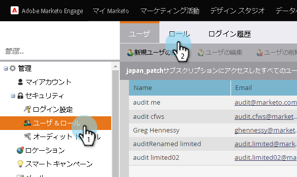
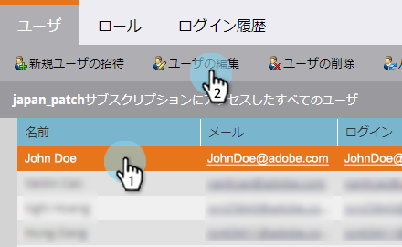

# 監査証跡を有効にする{#enable-audit-trail}

監査証跡は、すべてのお客様が利用でき、2つの管理者権限で制御します。

>[!NOTE]
>
>デフォルトでは、すべてのシステム管理者ロールで、両方の権限が有効になっています。

## ロールの監査証跡を有効にする{#enable-audit-trail-for-a-role}

1. 「**管理者**」をクリックします。

   

1. 「**ユーザーとロール**」を選択し、「**ロール**」をクリックします。

   

1. 監査証跡を有効にするロールを選択し、**ロールを編集**&#x200B;をクリックします。

   

   >[!NOTE]
   >
   >また、新しいロールを作成し、そのロールに「監査証跡」アクセス権を付与するオプションもあります。

1. **アクセス管理者**&#x200B;権限を展開します。 必要に応じて、「**監査証跡**&#x200B;にアクセス」または「**ログイン履歴**&#x200B;にアクセス」を選択します。 「**保存**」をクリックします。

   

   >[!NOTE]
   >
   >**定義**
   >
   >
   >**監査証跡へのアクセス：ユーザー** に、「Asset Audit Trail」と「Admin Audit Trail」の両方へのアクセス権を与えます。
   >
   >
   >**アクセスログイン履歴：ユーザー** に [ユーザーログイン履歴へのアクセスを許可します](user-login-history.md)。

## 監査証跡ロールのユーザーへの割り当て{#assign-audit-trail-role-to-a-user}

>[!PREREQUISITES]
>
>[既存のロールを](http://docs.marketo.com/display/DOCS/Create,+Delete,+Edit+and+Change+a+User+Role#Create,Delete,EditandChangeaUserRole-CreateaRole) 作成または  有効にし、監査証跡権限を付与します。

1. **ユーザーとロール**&#x200B;で、**ユーザー**&#x200B;をクリックします。

   

1. 監査証跡にアクセス権を付与するユーザーを選択し、「**ユーザーを編集**」をクリックします。

   

   >[!NOTE]
   >
   >このプロセスは、新しいユーザーを作成する場合にも適用されます。

1. 作成した監査証跡ロールを選択します。 この例では、「Audit Trail - Asset and Admin」と「Audit Trail - With Login History」を作成しました。

   

   >[!CAUTION]
   >
   >ワークスペースを有効にしている場合は、ロールのチェックボックスを必ずオンにして、すべてのワークスペースを選択します。 個々のワークスペースの選択を解除すると、監査証跡が非表示になります。 つまり、すべてのワークスペースに監査証跡データが表示されます。 [フィルター](http://docs.marketo.com/display/DOCS/Filtering+in+Audit+Trail)を適用するときに、ワークスペースを非表示にするオプションがあります。

1. 「**保存**」をクリックします。

   

