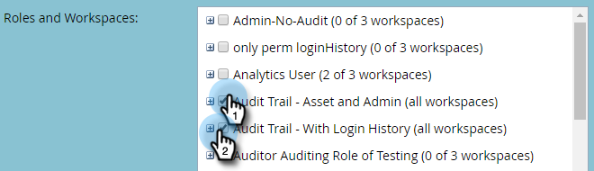

# 監査記録の有効化 {#enable-audit-trail}

監査記録は、すべてのお客様が使用でき、2 つの管理権限で管理されます。

>[!NOTE]
>
>デフォルトでは、すべてのシステム管理者のロールで、両方の権限が有効になっています。

## ロールの監査記録を有効にする {#enable-audit-trail-for-a-role}

1. 「**[!UICONTROL 管理者]**」をクリックします。

   

1. 「**[!UICONTROL ユーザー＆ロール]**」を選択し、「**[!UICONTROL ロール]**」をクリックします。

   

1. 監査記録を有効にするロールを選択し、「**[!UICONTROL ロールの編集]**」をクリックします。

   

   >[!NOTE]
   >
   >また、新しいロールを作成したり、監査記録アクセス権を付与したりするオプションも表示されます。

1. **[!UICONTROL 管理アクセス]**&#x200B;権限を展開します。必要に応じて、「**[!UICONTROL 監査記録にアクセス]**」と「**[!UICONTROL ログイン履歴にアクセス]**」のいずれかまたは両方を選択します。「**[!UICONTROL 保存]**」をクリックします。

   

   >[!NOTE]
   >
   >**定義**
   >
   >**[!UICONTROL 監査記録にアクセス]** - [!UICONTROL アセット監査記録]と[!UICONTROL 管理監査記録]の両方にアクセスできるようにします。
   >
   >**[!UICONTROL ログイン履歴にアクセス]**：[ユーザーログイン履歴](/help/marketo/product-docs/administration/audit-trail/user-login-history.md)にアクセスできるようにします。

## 監査記録のロールをユーザーに割り当てる {#assign-audit-trail-role-to-a-user}

>[!PREREQUISITES]
>
>ロールを[作成](/help/marketo/product-docs/administration/users-and-roles/create-delete-edit-and-change-a-user-role.md#create-a-role)するか、既存のロールを[有効](#enable-audit-trail)にして、監査記録の権限を付与します。

1. **[!UICONTROL ユーザー＆ロール]**&#x200B;で、「**[!UICONTROL ユーザー]**」をクリックします。

   

1. 監査記録の権限を付与するユーザーを選択して、「**[!UICONTROL ユーザーを編集]**」をクリックします。

   

   >[!NOTE]
   >
   >この手順は、新規ユーザーを作成している場合でも同様です。

1. 作成した監査記録のロールを選択します。ここでは、「監査記録 - アセットと管理」と「監査記録 - ログイン履歴」を作成しています。

   

   >[!CAUTION]
   >
   >ワークスペースを有効にしている場合は、必ずロールのチェックボックスを選択し、ワークスペースをすべて選択してください。個々のワークスペースの選択を解除すると、「監査記録」が非表示になります。つまり、すべてのワークスペースの「監査記録」データが表示されます。[フィルター](/help/marketo/product-docs/administration/audit-trail/filtering-in-audit-trail.md)を適用すると、ワークスペースを非表示にするオプションがあります。

1. 「**[!UICONTROL 保存]**」をクリックします。

   
