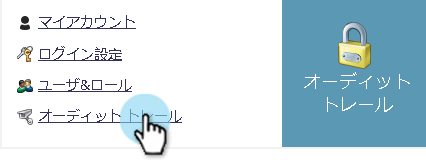
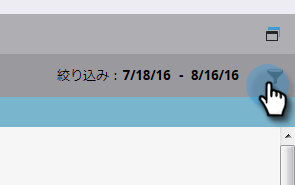

# 監査証跡でのフィルタリング {#filtering-in-audit-trail}

時間枠、アセットタイプ、ユーザー、実行されたアクションなどでフィルターします。

1. 「 **管理者**」をクリックします。

   

1. 「 **Security**」で、「 **Audit Trail**」を選択します。

   

1. フィルターアイコンをクリックします。

   

   >[!NOTE]
   >
   >検索パラメーターの組み合わせには、多数の可能性があります。 この例では、次の場所を見つけます。 *すべての電子メール — 誰でも編集可能 — 過去7日間*。

1. 「 **期間** 」ドロップダウンをクリックし、「 **過去7日間**」を選択します。

   

1. 「 **アセットタイプ** 」ドロップダウンをクリックし、「 **電子メール**」を選択します。

   

1. 「 **アクション** 」ドロップダウンをクリックし、「 **編集**」を選択します。

   

1. 「 **適用**」をクリックします。

   

1. フィルターを適用した結果が左側に表示されます。

   

   それだ！

   >[!NOTE]
   >
   >ワークスペースを有効にしている場合、すべてのワークスペースの監査データが表示されます。 ワークスペースフィルターを適用すると、監査証跡を使用するたびに、以前のワークスペース値がマーケティング担当者に記憶されます。 アセットレベルのワークスペース権限は適用されます。

   >[!NOTE]
   >
   >**関連記事**
   >
   >    
   >    
   >    * [監査証跡の詳細の変更](change-details-in-audit-trail.md)

