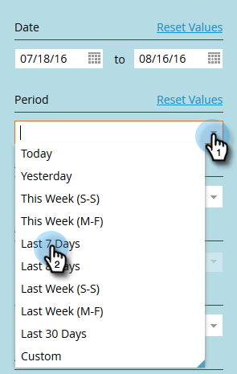

# 監査記録のフィルタリング {#filtering-in-audit-trail}

時間枠、アセットタイプ、ユーザ、実行されたアクションなどでフィルターできます。

1. 「**[!UICONTROL 管理者]**」をクリックします。

   

1. 「**[!UICONTROL セキュリティ]**」で、「**[!UICONTROL 監査記録]**」を選択します。

   

1. フィルターアイコンをクリックします。

   

   >[!NOTE]
   >
   >検索パラメーターの組み合わせは、数多くあります。 この例では、過去7日間に&#x200B;_すべての電子メール – 誰でも編集した電子メール_&#x200B;を検索します。

1. **[!UICONTROL 期間]**&#x200B;ドロップダウンをクリックし、**[!UICONTROL 過去 7 日間]**&#x200B;を選択します。

   

1. **[!UICONTROL アセットタイプ]**&#x200B;ドロップダウンをクリックし、**[!UICONTROL メール]**&#x200B;を選択します。

   

1. 「**[!UICONTROL アクション]**」ドロップダウンをクリックし、**[!UICONTROL 編集]**&#x200B;を選択します。

   

1. 「**[!UICONTROL 適用]**」をクリックします。

   

1. フィルター結果は左側に表示されます。

   

   >[!NOTE]
   >
   >ワークスペースを有効にしている場合は、すべてのワークスペースの監査データが表示されます。 ワークスペースフィルターを適用すると、監査証跡を使用するたびに、Marketoは以前のワークスペース値を記憶します。 アセットレベルでのワークスペース権限が適用されます。

   >[!MORELIKETHIS]
   >
   >[監査記録の詳細の変更](/help/marketo/product-docs/administration/audit-trail/change-details-in-audit-trail.md)
