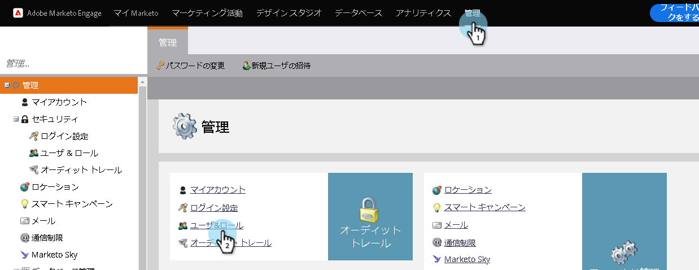
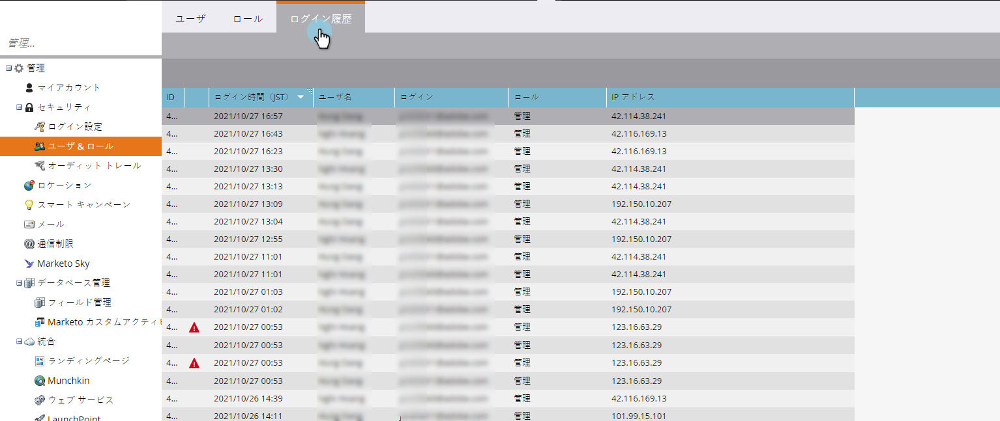
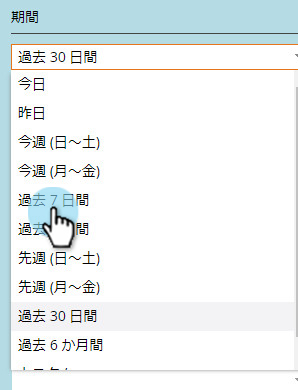
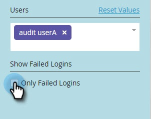

# ユーザーログイン履歴{#user-login-history}

[ユーザログイン履歴]は、ログイン試行の失敗など、購読にログインしているユーザを正確に示すことで、説明責任とセキュリティを維持するのに役立ちます。

>[!PREREQUISITES]
>
>ユーザログイン履歴を表示するには、「アクセスログイン履歴」権限が有効なロールが必要です。

[ユーザログイン履歴]は、次の方法でログインしたユーザを識別します。

* ログイン日時
* ユーザーの名前と電子メールアドレス
* 役割
* Workspace
* IPアドレス

ユーザログイン履歴を表示するには：

1. 「**管理者**」タブをクリックし、「セキュリティ」の下の「**ユーザーとロール**」をクリックします。

   

1. 「**ログイン履歴**」タブをクリックします。 一覧には、最新のログインが表示されます。

   

1. 「フィルター」を使用して検索を絞り込みます。

   

1. 日付選択ツールを使用して日付範囲を選択します。

   

1. または、ドロップダウンから選択します。

   

1. **ユーザー**&#x200B;ドロップダウンからユーザーを選択します。

   

1. 「**失敗したログインのみ**」ボックスをオンにすると、失敗したログインのみが検索に表示されます。

   

1. 「**適用**」をクリックします。

   

   >[!NOTE]
   >
   >ユーザーインターフェイスには、最大30日間のデータが表示されます。 さらに必要な場合は、最新の6か月分のデータをCSVファイルにダウンロードできます。

   >[!NOTE]
   >
   >[監査証跡の概要](/help/marketo/product-docs/administration/audit-trail/audit-trail-overview.md)
