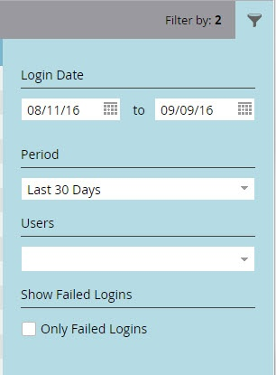

# ユーザログイン履歴 {#user-login-history}

ユーザログイン履歴は、ログイン試行の失敗を含め、サブスクリプションにログインしているユーザを正確に示すことで、信頼性とセキュリティを維持するのに役立ちます。

>[!PREREQUISITES]
>
>ユーザログイン履歴を表示するには、「ログイン履歴へのアクセス」権限を有効にしたロールが必要です。

ユーザログイン履歴は、次の方法でログインしたユーザを特定します。

* ログイン日時
* ユーザーの名前とメールアドレス
* ロール
* ワークスペース
* IP アドレス

ユーザログイン履歴を表示するには：

1. 「**[!UICONTROL 管理者]**」領域に移動します。

   

1. 「セキュリティ」で「**[!UICONTROL ユーザとロール]**」をクリックします。

   

1. 「**[!UICONTROL ログイン履歴]**」タブをクリックします。 リストには、最新のログインが表示されます。

   

1. フィルターを使用して検索を絞り込みます。

   

1. 日付選択を使用して日付範囲を選択します。

   

1. ドロップダウンから選択します。

   

1. ユーザを「**[!UICONTROL ユーザ]**」ドロップダウンリストから選択します。

   

1. 「**[!UICONTROL 失敗したログインのみ]**」ボックスにチェックを入力すると、失敗したログインのみ検索に表示されます。

   

1. 「**[!UICONTROL 適用]**」をクリックします。

   

   >[!NOTE]
   >
   >ユーザインターフェイスには最大 30 日分のデータが表示されます。 さらに必要な場合は、最新の6か月間のデータをCSV ファイルにダウンロードできます。

   >[!MORELIKETHIS]
   >
   >[監査記録の概要](/help/marketo/product-docs/administration/audit-trail/audit-trail-overview.md)
