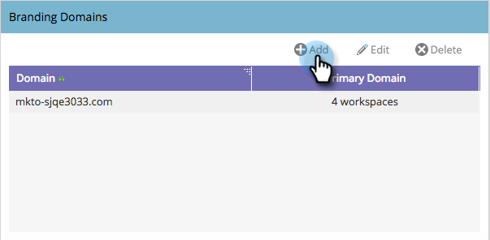

# ワークスペースを使用した付加的なブランディングドメインの追加 {#add-an-additional-branding-domain-with-workspaces}

ワークスペースがある場合は、ブランディングドメインを追加できます。

>[!PREREQUISITES]
>
>必ず[デフォルトのブランディングドメインの編集](/help/marketo/product-docs/administration/email-setup/add-multiple-branding-domains/edit-your-default-branding-domain.md)を先に行ってください。
>
>最初にブランディングドメインと[一般トラッキングリンクの置き換え](/help/marketo/product-docs/administration/email-setup/add-multiple-branding-domains/edit-your-default-branding-domain-with-workspaces.md)を行ってから、ブランディングドメインに追加する必要があります。

1. 「**管理者**」領域に移動します。

   

1. 「**メール**」をクリックします。

   

1. 「**追加**」をクリックして、ブランディングドメインを追加します。

   

1. 新しいブランディングドメインを入力します。「**次へ**」をクリックします。

   

   >[!NOTE]
   >
   >1 つ以上のワークスペースに対してこれをプライマリドメインにすることができます。既存の未送信メールはすべて「デフォルト」に設定され、新しく作成されたすべてのメールはデフォルトでプライマリドメインに設定されます。 これは、メールごとに上書きできます。

1. 新しいブランディングドメインを選択し、「**保存**」をクリックします。

   
